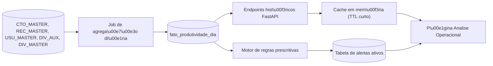

# Pipeline da Análise Operacional

Documento de referência para a nova área **Análise Operacional** (substituta do placeholder atual `Análise profunda`, página [src/pages/AnaliseProfunda.tsx](../src/pages/AnaliseProfunda.tsx)).

Esta é a fonte conceitual. Os contratos de endpoints e o mapa de KPIs aqui descritos serão implementados em fases futuras — nenhuma query SQL real está escrita neste doc (segue o padrão "placeholder mode" de [missing-endpoints-contracts.md](missing-endpoints-contracts.md)).

---

## 1. Contexto e escopo

O dashboard atual ([Index.tsx](../src/pages/Index.tsx), [ComparacaoAgentes.tsx](../src/pages/ComparacaoAgentes.tsx), [AnaliseProdutividade.tsx](../src/pages/AnaliseProdutividade.tsx), [DetalhamentoAgentes.tsx](../src/pages/DetalhamentoAgentes.tsx)) opera exclusivamente na janela **do dia corrente** (regra global `@Hoje <= data < @Amanha`, ver [mapa-kpis-dashboard.md](mapa-kpis-dashboard.md)). Ele responde "como estamos agora" e existe para tomada de atitude imediata.

A **Análise Operacional** é uma camada paralela, não substitutiva, para decisões de médio prazo:

- Janela longa (semanas / meses / anos).
- Cruzamento de múltiplos fatores (agente × portfólio × hora × dia da semana × mês).
- Foco em identificar **padrões**, não eventos isolados.
- Foco em gerar **ações** (coaching, realocação, alertas), não só números.

### Nota sobre o nome

"Análise Operacional" tem sobreposição semântica com os painéis existentes, que também são operacionais no dia a dia. O termo foi escolhido pelo negócio para enfatizar que o objetivo final é **orientar a operação** (coaching, realocação, priorização), não fazer ciência de dados. Alternativas consideradas: "Análise Histórica", "Inteligência Operacional", "Análise Estratégica". Decisão final pendente — ver seção 8.

### Limite explícito

Esta área **não** substitui nenhum painel existente. Se o usuário quer saber o resultado do dia, ele continua em `Index`. A Análise Operacional só é aberta quando a pergunta envolve janela maior que um dia.

---

## 2. Modelo de 3 níveis (pirâmide analítica)

Inspirado na pirâmide analítica clássica (Gartner), adaptada para o contexto de cobrança:

| Nível | Pergunta que responde | Exemplo no contexto de cobrança |
|---|---|---|
| **Descritivo** | "O que aconteceu?" | "Fechamos 50 acordos em 500 contatos no mês" |
| **Diagnóstico** | "Por que aconteceu?" | "Conversão cai 30% depois das 16h; agente X tem 0% conversão há 5 dias" |
| **Prescritivo** | "O que fazer?" | "Realocar agentes da tarde; coaching em X; priorizar portfólio Y" |

O quarto nível clássico (Preditivo — "o que vai acontecer?") **fica fora do escopo inicial**. Modelos estatísticos só entram na fase 5 do roadmap, se justificarem o custo.

### Organização na interface

Os três níveis são apresentados como **seções verticais na mesma página**, na ordem do raciocínio (descritivo → diagnóstico → prescritivo), ao invés de abas separadas. Justificativa: o fluxo de leitura natural já induz o usuário a conectar o "o quê" com o "por quê" com o "o que fazer". Abas fragmentariam esse raciocínio.

---

## 3. Mapa de KPIs por nível

Formato idêntico ao [mapa-kpis-dashboard.md](mapa-kpis-dashboard.md). As queries reais ficam como `TODO: BUSINESS_QUERY_REQUIRED` até validação com o negócio.

### 3.1 Descritivo

| KPI | Fórmula conceitual | Agregação temporal | Endpoint proposto | Origem principal |
|---|---|---|---|---|
| `acionamentos_serie` | `COUNT(DISTINCT ID_CTO_MASTER)` por período | dia / semana / mês | `/dashboard/operacional/descritivo/{db}` | `CTO_MASTER` |
| `contatos_serie` | `COUNT(DISTINCT ID_CTO_MASTER WHERE CPC)` por período | dia / semana / mês | mesmo | `CTO_MASTER` |
| `cpc_historico` | `contatos_serie / acionamentos_serie * 100` | dia / semana / mês | mesmo | derivado |
| `acordos_serie` | `COUNT(DISTINCT NR_RECEBIMENTO WHERE aprovados)` por período | dia / semana / mês | mesmo | `REC_MASTER` |
| `valor_acordos_serie` | `SUM(valor_total_acordo WHERE aprovados)` por período | dia / semana / mês | mesmo | `REC_MASTER` |
| `ticket_medio_historico` | `AVG(valor_total_acordo WHERE aprovados)` por período | mês | mesmo | `REC_MASTER` |
| `taxa_conversao_historica` | `acordos_serie / acionamentos_serie * 100` | dia / semana / mês | mesmo | derivado |
| `excecoes_serie` | `COUNT(DISTINCT NR_RECEBIMENTO WHERE status=11)` | dia / semana / mês | mesmo | `REC_MASTER` |
| `primeira_parcela_serie` | `SUM(VALOR WHERE PARCELA=0 AND aprovados)` | dia / semana / mês | mesmo | `REC_MASTER` |
| `desconto_medio_historico` | `AVG(valor_total_acordo / VR_ORIGINAL * 100)` | mês | mesmo | `REC_MASTER` + `REC_DIVIDAS` + `DIV_MASTER` |

### 3.2 Diagnóstico

| KPI / Corte | Pergunta que responde | Endpoint proposto | Origem |
|---|---|---|---|
| `conversao_por_hora` | "Em que horas convertemos mais / menos?" | `/dashboard/operacional/diagnostico/{db}?corte=hora` | `CTO_MASTER` + `REC_MASTER` |
| `conversao_por_dia_semana` | "Segunda é pior que sexta?" | `/dashboard/operacional/diagnostico/{db}?corte=dia_semana` | `CTO_MASTER` + `REC_MASTER` |
| `agentes_fora_da_media` | "Quem está sistematicamente abaixo?" | `/dashboard/operacional/diagnostico/{db}?corte=agente` | `CTO_MASTER` + `REC_MASTER` + `USU_MASTER` |
| `portfolios_em_queda` | "Que portfólios perderam performance?" | `/dashboard/operacional/diagnostico/{db}?corte=portfolio` | `REC_MASTER` + `DIV_AUX.CAMPO010` |
| `comparativo_mes_vs_mes` | "Este mês contra o anterior?" | `/dashboard/operacional/diagnostico/{db}?corte=mes_vs_mes` | fato agregado |
| `sazonalidade_primeira_parcela` | "1ª parcela concentra em que dias?" | `/dashboard/operacional/diagnostico/{db}?corte=sazonalidade` | `REC_MASTER` |
| `correlacao_esforco_conversao` | "Mais acionamento vira mais acordo?" | `/dashboard/operacional/diagnostico/{db}?corte=correlacao` | derivado |
| `dispersao_agentes` | "Qual a variância entre agentes?" | `/dashboard/operacional/diagnostico/{db}?corte=dispersao` | `CTO_MASTER` + `USU_MASTER` |

**Detecção de anomalias** (opcional, fase 3 avançada): flag simples por desvio-padrão (ex.: valor fora de ±2σ da média móvel de 30 dias). Sem ML.

### 3.3 Prescritivo

Regras **determinísticas e auditáveis**. Cada uma tem: condição → severidade → ação sugerida.

| Regra | Condição | Severidade | Ação sugerida |
|---|---|---|---|
| `flag_coaching_agente` | Agente com ≥ N acionamentos/dia e conversão = 0% por 3 dias consecutivos | alta | Coaching individual imediato |
| `sinal_realocacao_turno` | Queda de conversão > 30% depois das 16h por ≥ 5 dias úteis | média | Realocar agentes da tarde ou revisar horário de contato |
| `alerta_portfolio_em_risco` | Portfólio com queda ≥ 20% em acordos mês vs. mês anterior | alta | Revisar estratégia / régua do portfólio |
| `excesso_excecoes_agente` | Agente com `qtd_excecoes / qtd_acordos > X%` no mês | média | Auditoria de exceções |
| `desconto_fora_do_padrão` | Desconto médio do agente > 1.5× a média do escritório | média | Revisão de alçada |
| `baixo_aproveitamento_cpc` | Agente com CPC alto mas conversão baixa | média | Treinamento de fechamento |
| `concentracao_primeira_parcela` | > 80% da primeira parcela concentrada em < 20% dos agentes | baixa | Redistribuir carteira |

Os parâmetros `N`, `X`, janelas e limiares ficam em **arquivo de configuração** separado (não hardcoded), para o negócio ajustar sem deploy. Sugestão: `backend/rules/operacional.yaml` ou tabela em banco.

---

## 4. Pipeline de dados



### 4.1 Justificativa de cada etapa

- **Job de agregação diária**: executar queries de 12+ meses ao vivo em `CTO_MASTER` / `REC_MASTER` é inviável (tempo de resposta e carga no banco). O job roda uma vez por dia, fora do horário comercial.
- **Tabela fato `fato_produtividade_dia`**: granularidade mínima dia × agente × portfólio × banco. Permite qualquer recorte sem reprocessar a origem. Tamanho estimado: ~28 meses × ~X agentes × ~Y portfólios = volume gerenciável.
- **Endpoints históricos**: leem **apenas** da tabela fato, nunca das origens. Isola performance.
- **Cache em memória (TTL curto)**: mesma janela é consultada por múltiplos usuários; TTL de 5-15min evita reprocessar. Usar o padrão já presente no projeto.
- **Motor de regras prescritivas**: separado do endpoint descritivo. Lê da tabela fato, aplica as regras da seção 3.3, grava em tabela de alertas. Permite ajustar regras sem tocar em queries descritivas.
- **Tabela de alertas ativos**: estado persistido. Cada alerta tem timestamp, status (ativo / resolvido / ignorado), severidade. Permite histórico e auditoria das ações tomadas.

### 4.2 Origem → destino

| Origem | Campos relevantes | Destino no fato |
|---|---|---|
| `CTO_MASTER` | `ID_CTO_MASTER`, `ID_COMPLEMENTO`, `DATA`, agente | `qtd_acionamentos`, `qtd_contatos` |
| `REC_MASTER` | `NR_RECEBIMENTO`, `ID_REC_STATUS`, `PLANO`, `PARCELA`, `VALOR` | `qtd_acordos`, `qtd_excecoes`, `valor_acordos`, `valor_primeira_parcela` |
| `REC_DIVIDAS` + `DIV_MASTER` | `VR_ORIGINAL`, `VR_SALDO` | `desconto_medio` |
| `DIV_AUX.CAMPO010` | portfólio | dimensão portfólio |
| `USU_MASTER` | `CHAVE`, nome | dimensão agente |

### 4.3 Expurgos herdados

Mantém os mesmos expurgos do backend atual ([main.py](../../main.py)): agentes `COBDESANTOS`, `NEMBUSUSER`, prefixos `ANTLIA%` e `INTERNA%`. Devem ser aplicados no **job de agregação**, não nas queries de leitura, para garantir consistência com o resto do dashboard.

---

## 5. Contratos de endpoints

Seguindo o padrão "placeholder mode" de [missing-endpoints-contracts.md](missing-endpoints-contracts.md). Queries SQL ficam como `TODO: BUSINESS_QUERY_REQUIRED`.

### 5.1 Descritivo

- **Endpoint**: `GET /dashboard/operacional/descritivo/{database_name}`
- **Purpose**: Séries temporais dos KPIs principais em janela longa.
- **Query Placeholder**: `TODO: BUSINESS_QUERY_REQUIRED`

**Query params**:
- `start_date` (obrigatório, `YYYY-MM-DD`)
- `end_date` (obrigatório, `YYYY-MM-DD`)
- `interval` (opcional, default `month`: `day | week | month`)
- `assessoria` (opcional)

**Response contract**:
```json
{
  "meta": {
    "generated_at": "ISO-8601",
    "total_rows": 0,
    "sources": ["fato_produtividade_dia"],
    "filters": {
      "start_date": "YYYY-MM-DD",
      "end_date": "YYYY-MM-DD",
      "interval": "month",
      "assessoria": "string"
    }
  },
  "data": [
    {
      "period": "YYYY-MM",
      "qtd_acionamentos": 0,
      "qtd_contatos": 0,
      "cpc_percentual": 0.0,
      "qtd_acordos": 0,
      "valor_acordos": 0.0,
      "taxa_conversao": 0.0,
      "ticket_medio": 0.0,
      "qtd_excecoes": 0,
      "valor_primeira_parcela": 0.0,
      "desconto_medio_percentual": 0.0
    }
  ],
  "errors": []
}
```

Observação: há sobreposição intencional com o `/dashboard/produtividade-historico/{db}` já previsto em [missing-endpoints-contracts.md](missing-endpoints-contracts.md). Decisão pendente: **unificar** em um só endpoint (preferível) ou **manter separados**. Se unificar, este é o endpoint oficial e o outro sai do backlog.

### 5.2 Diagnóstico

- **Endpoint**: `GET /dashboard/operacional/diagnostico/{database_name}`
- **Purpose**: Cortes cruzados para explicar variações vistas no descritivo.
- **Query Placeholder**: `TODO: BUSINESS_QUERY_REQUIRED`

**Query params**:
- `start_date` (obrigatório)
- `end_date` (obrigatório)
- `corte` (obrigatório: `hora | dia_semana | agente | portfolio | mes_vs_mes | sazonalidade | correlacao | dispersao`)
- `assessoria` (opcional)

**Response contract** (o formato de `data` varia por `corte`; a envelope é estável):
```json
{
  "meta": {
    "generated_at": "ISO-8601",
    "total_rows": 0,
    "sources": ["fato_produtividade_dia"],
    "filters": {
      "start_date": "YYYY-MM-DD",
      "end_date": "YYYY-MM-DD",
      "corte": "hora",
      "assessoria": "string"
    }
  },
  "data": [
    {
      "dimensao_label": "string",
      "dimensao_valor": "string",
      "qtd_acionamentos": 0,
      "qtd_contatos": 0,
      "qtd_acordos": 0,
      "taxa_conversao": 0.0,
      "desvio_vs_media": 0.0
    }
  ],
  "errors": []
}
```

### 5.3 Prescritivo

- **Endpoint**: `GET /dashboard/operacional/prescritivo/{database_name}`
- **Purpose**: Listar alertas/recomendações ativos gerados pelo motor de regras.
- **Query Placeholder**: `TODO: RULES_ENGINE_PENDING`

**Query params**:
- `severidade` (opcional: `alta | media | baixa`)
- `status` (opcional, default `ativo`: `ativo | resolvido | ignorado`)
- `assessoria` (opcional)

**Response contract**:
```json
{
  "meta": {
    "generated_at": "ISO-8601",
    "total_rows": 0,
    "sources": ["alertas_operacional"],
    "filters": {
      "severidade": "alta",
      "status": "ativo"
    }
  },
  "data": [
    {
      "alerta_id": "string",
      "regra": "flag_coaching_agente",
      "severidade": "alta",
      "status": "ativo",
      "titulo": "string",
      "descricao": "string",
      "acao_sugerida": "string",
      "entidade_tipo": "agente|portfolio|escritorio",
      "entidade_id": "string",
      "entidade_nome": "string",
      "metrica_gatilho": 0.0,
      "criado_em": "ISO-8601",
      "dados_referencia": {
        "link_diagnostico": "string"
      }
    }
  ],
  "errors": []
}
```

O campo `dados_referencia.link_diagnostico` aponta para o endpoint de diagnóstico que comprova a regra, permitindo drill-up inverso (prescritivo → diagnóstico) na interface.

---

## 6. Interface (proposta)

Página `src/pages/AnaliseOperacional.tsx`.

### 6.1 Estrutura da página

```
+---------------------------------------------------------------+
| Header: "Analise Operacional" + SidebarTrigger                 |
+---------------------------------------------------------------+
| Filtros (sticky):                                              |
|   [ Periodo: Mes atual / 3m / 6m / 12m / Custom ]              |
|   [ Banco: Todas / AUTOS / CONSUMER ]                          |
|   [ Assessoria: opcional ]                                     |
+---------------------------------------------------------------+
| Secao 1 - DESCRITIVO ("O que aconteceu?")                      |
|   Cards de KPI agregados no periodo                            |
|   Grafico de serie temporal (linha + barras compostas)         |
|   Comparativo periodo atual vs. anterior                       |
+---------------------------------------------------------------+
| Secao 2 - DIAGNOSTICO ("Por que aconteceu?")                   |
|   Abas internas de corte: Hora | Dia semana | Agente |         |
|                           Portfolio | Mes vs mes | Correlacao  |
|   Grafico + tabela do corte selecionado                        |
|   Destaque visual para outliers (± 2 sigma)                    |
+---------------------------------------------------------------+
| Secao 3 - PRESCRITIVO ("O que fazer?")                         |
|   Lista de alertas agrupados por severidade                    |
|   Cada card: titulo + descricao + acao sugerida +              |
|              botao "ver diagnostico" (drill-up inverso)        |
+---------------------------------------------------------------+
```

### 6.2 Regras de UX

- **Ordem fixa** (descritivo → diagnóstico → prescritivo): induz o raciocínio. Sem abas superiores.
- **Drill-up inverso**: cada alerta prescritivo linka para o diagnóstico que o gerou. Ex.: clicar em "flag_coaching_agente:AGT_123" scrolla para a seção de diagnóstico já filtrada por aquele agente.
- **Integração com filtros existentes**: o seletor `DatabaseOption` é reaproveitado (ver [AnaliseProdutividade.tsx](../src/pages/AnaliseProdutividade.tsx) e demais páginas).
- **Loading incremental**: cada seção carrega independente; o prescritivo pode aparecer antes do descritivo terminar, por exemplo.
- **Empty states explícitos**: cada seção tem mensagem quando não há dados no período ou nenhum alerta ativo.

### 6.3 Componentes reutilizáveis

Onde possível, reaproveitar os componentes já existentes:

- `DashboardV2ChartsPanel` como referência de padrão visual para os gráficos.
- `AnaliseChartsPanel` como base para os cortes de diagnóstico.
- Tipos e funções de `src/services/api.ts`.

---

## 7. Roadmap de implementação

| Fase | Escopo | Entregáveis | Dependências |
|---|---|---|---|
| **0** | Conceitual (este doc) | `pipeline-analise-operacional.md` aprovado | — |
| **1** | Backend descritivo | Tabela `fato_produtividade_dia` + job de agregação + endpoint `/operacional/descritivo/{db}` | Acesso a SQL Agent ou equivalente p/ rodar job |
| **2** | Frontend descritivo | Renomear `AnaliseProfunda.tsx` → `AnaliseOperacional.tsx`, atualizar rota em [App.tsx](../src/App.tsx) e label em [AppSidebar.tsx](../src/components/AppSidebar.tsx), implementar seção descritiva | Fase 1 concluída |
| **3** | Diagnóstico | Endpoint `/operacional/diagnostico/{db}` + componente `DiagnosticoChartsPanel` | Fase 1 (tabela fato) |
| **4** | Prescritivo | Motor de regras (arquivo de configuração + job) + tabela `alertas_operacional` + endpoint `/operacional/prescritivo/{db}` + UI de alertas + drill-up inverso | Fase 3 (diagnóstico serve de referência) |
| **5** *(opcional)* | Evolução estatística/ML | Previsões de curto prazo, detecção de anomalia baseada em modelo | Avaliar ROI após fase 4 |

Cada fase é independente em valor: ao final da fase 2 a área já entrega valor (histórico navegável), sem depender das fases seguintes.

---

## 8. Decisões pendentes

Lista de pontos que precisam de definição antes ou durante a implementação:

1. **Nome definitivo** da área: "Análise Operacional" vs. alternativas ("Análise Histórica", "Inteligência Operacional", "Análise Estratégica"). Impacta label no sidebar e rota.
2. **Profundidade histórica real disponível**: [data-coverage-analysis.md](data-coverage-analysis.md) cita "28 meses + 15 dias". Validar com DBA antes de prometer janelas longas na UI.
3. **Unificação com `/produtividade-historico/{db}`**: manter os dois endpoints ou unificar no `/operacional/descritivo/{db}`? Recomendação: unificar.
4. **Lista final de regras prescritivas**: a seção 3.3 traz uma proposta; negócio precisa validar quais entram na v1.
5. **Parâmetros das regras**: valores iniciais de `N`, `X`, janelas e limiares. Sugestão: configurar em YAML ou tabela para ajuste sem deploy.
6. **Onde vive o job de agregação**: SQL Agent, cron Python dentro do FastAPI, serviço externo? Impacta operação.
7. **Granularidade da tabela fato**: dia × agente × portfólio × banco é suficiente? Precisa dia × agente × portfólio × **hora** para o corte `conversao_por_hora`? Se sim, tamanho cresce ~24×.
8. **Política de retenção de alertas**: alertas resolvidos permanecem eternamente ou têm TTL?

---

## 9. Referências

- [mapa-kpis-dashboard.md](mapa-kpis-dashboard.md) — KPIs do dashboard operacional atual (janela do dia).
- [missing-endpoints-contracts.md](missing-endpoints-contracts.md) — padrão de contratos usado neste doc.
- [data-coverage-analysis.md](data-coverage-analysis.md) — análise de cobertura e gaps de dados.
- [refactor_main_py_report.md](refactor_main_py_report.md) — estado atual do backend.
- [../src/pages/AnaliseProfunda.tsx](../src/pages/AnaliseProfunda.tsx) — placeholder atual que será renomeado na fase 2.
