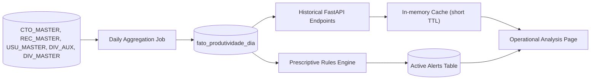

# Operational Analysis Pipeline

Reference document for the new **Operational Analysis** area (replacement for the current `Analise profunda` placeholder at [src/pages/AnaliseProfunda.tsx](../src/pages/AnaliseProfunda.tsx)).

This is the conceptual source of truth. The endpoint contracts and KPI map described here are scheduled for future phases; no production SQL query is included in this document (same "placeholder mode" pattern used in [missing-endpoints-contracts.md](missing-endpoints-contracts.md)).

---

## 1. Context and Scope

The current dashboard ([Index.tsx](../src/pages/Index.tsx), [ComparacaoAgentes.tsx](../src/pages/ComparacaoAgentes.tsx), [AnaliseProdutividade.tsx](../src/pages/AnaliseProdutividade.tsx), [DetalhamentoAgentes.tsx](../src/pages/DetalhamentoAgentes.tsx)) operates strictly on a **same-day window** (global rule `@Hoje <= data < @Amanha`, see [mapa-kpis-dashboard.md](mapa-kpis-dashboard.md)). It answers “how are we performing now?” and is designed for immediate operational response.

**Operational Analysis** is a parallel (non-replacement) layer for medium-term decisions:

- Long window horizon (weeks / months / years).
- Multi-factor cuts (agent × portfolio × hour × weekday × month).
- Pattern detection rather than isolated-event reporting.
- Action-oriented outputs (coaching, reallocation, alerts), not only descriptive metrics.

### Naming Note

“Operational Analysis” partially overlaps with current pages that are also operational. The business team selected this name to emphasize that the intended output is **operational guidance** (coaching, reallocation, prioritization), not data science exploration. Considered alternatives: “Historical Analysis”, “Operational Intelligence”, “Strategic Analysis”. Final naming remains pending (see section 8).

### Explicit Boundary

This area **does not** replace existing pages. If the user needs same-day status, `Index` remains the correct entry point. Operational Analysis is intended for questions that require a window broader than one day.

---

## 2. Three-Level Model (analytical pyramid)

Adapted from the classical analytical pyramid (Gartner) to the collections domain:

| Level | Question answered | Collections-domain example |
|---|---|---|
| **Descriptive** | "What happened?" | "We closed 50 agreements from 500 contacts in the month" |
| **Diagnostic** | "Why did it happen?" | "Conversion drops 30% after 4 PM; agent X has 0% conversion for 5 days" |
| **Prescriptive** | "What should we do?" | "Reallocate afternoon agents, coach X, prioritize portfolio Y" |

The fourth classical level (Predictive — “what will happen?”) is **out of initial scope**. Statistical/ML models are only considered in roadmap phase 5 if ROI is justified.

### UI Organization

All three levels are presented as **vertical sections within the same page**, ordered by reasoning flow (descriptive -> diagnostic -> prescriptive), instead of separate tabs. Rationale: a single reading flow naturally connects “what”, “why”, and “what to do”. Tab separation would fragment this reasoning path.

---

## 3. KPI Map by Analytical Level

Format follows [mapa-kpis-dashboard.md](mapa-kpis-dashboard.md). Production queries remain as `TODO: BUSINESS_QUERY_REQUIRED` until business validation.

### 3.1 Descriptive

| KPI | Conceptual formula | Temporal aggregation | Proposed endpoint | Primary source |
|---|---|---|---|---|
| `acionamentos_serie` | `COUNT(DISTINCT ID_CTO_MASTER)` by period | day / week / month | `/dashboard/operacional/descritivo/{db}` | `CTO_MASTER` |
| `contatos_serie` | `COUNT(DISTINCT ID_CTO_MASTER WHERE CPC)` by period | day / week / month | same | `CTO_MASTER` |
| `cpc_historico` | `contatos_serie / acionamentos_serie * 100` | day / week / month | same | derived |
| `acordos_serie` | `COUNT(DISTINCT NR_RECEBIMENTO WHERE approved)` by period | day / week / month | same | `REC_MASTER` |
| `valor_acordos_serie` | `SUM(valor_total_acordo WHERE approved)` by period | day / week / month | same | `REC_MASTER` |
| `ticket_medio_historico` | `AVG(valor_total_acordo WHERE approved)` by period | month | same | `REC_MASTER` |
| `taxa_conversao_historica` | `acordos_serie / acionamentos_serie * 100` | day / week / month | same | derived |
| `excecoes_serie` | `COUNT(DISTINCT NR_RECEBIMENTO WHERE status=11)` | day / week / month | same | `REC_MASTER` |
| `primeira_parcela_serie` | `SUM(VALOR WHERE PARCELA=0 AND approved)` | day / week / month | same | `REC_MASTER` |
| `desconto_medio_historico` | `AVG(valor_total_acordo / VR_ORIGINAL * 100)` | month | same | `REC_MASTER` + `REC_DIVIDAS` + `DIV_MASTER` |

### 3.2 Diagnostic

| KPI / Slice | Question answered | Proposed endpoint | Source |
|---|---|---|---|
| `conversao_por_hora` | "At which hours do we convert better/worse?" | `/dashboard/operacional/diagnostico/{db}?corte=hora` | `CTO_MASTER` + `REC_MASTER` |
| `conversao_por_dia_semana` | "Is Monday weaker than Friday?" | `/dashboard/operacional/diagnostico/{db}?corte=dia_semana` | `CTO_MASTER` + `REC_MASTER` |
| `agentes_fora_da_media` | "Who is consistently below baseline?" | `/dashboard/operacional/diagnostico/{db}?corte=agente` | `CTO_MASTER` + `REC_MASTER` + `USU_MASTER` |
| `portfolios_em_queda` | "Which portfolios are losing performance?" | `/dashboard/operacional/diagnostico/{db}?corte=portfolio` | `REC_MASTER` + `DIV_AUX.CAMPO010` |
| `comparativo_mes_vs_mes` | "Current month vs previous month?" | `/dashboard/operacional/diagnostico/{db}?corte=mes_vs_mes` | aggregated fact |
| `sazonalidade_primeira_parcela` | "On which days is first-installment concentration highest?" | `/dashboard/operacional/diagnostico/{db}?corte=sazonalidade` | `REC_MASTER` |
| `correlacao_esforco_conversao` | "Does increased effort convert into agreements?" | `/dashboard/operacional/diagnostico/{db}?corte=correlacao` | derived |
| `dispersao_agentes` | "How large is cross-agent variance?" | `/dashboard/operacional/diagnostico/{db}?corte=dispersao` | `CTO_MASTER` + `USU_MASTER` |

**Anomaly detection** (optional, advanced phase 3): simple z-score style flag (for example, values outside ±2σ over a 30-day moving baseline). No ML in initial scope.

### 3.3 Prescriptive

Rules are **deterministic and auditable**. Each rule follows: condition -> severity -> recommended action.

| Rule | Condition | Severity | Recommended action |
|---|---|---|---|
| `flag_coaching_agente` | Agent with >= N daily attempts and 0% conversion for 3 consecutive days | high | Immediate one-on-one coaching |
| `sinal_realocacao_turno` | Conversion drop > 30% after 4 PM for >= 5 business days | medium | Reallocate afternoon capacity or review contact timing |
| `alerta_portfolio_em_risco` | Portfolio with >= 20% agreement decline month-over-month | high | Review portfolio strategy and contact policy |
| `excesso_excecoes_agente` | Agent with `qtd_excecoes / qtd_acordos > X%` in month window | medium | Exception policy audit |
| `desconto_fora_do_padrão` | Agent average discount > 1.5x office baseline | medium | Discount authority review |
| `baixo_aproveitamento_cpc` | Agent with high CPC and low conversion | medium | Closing-skills coaching |
| `concentracao_primeira_parcela` | > 80% first-installment concentration in < 20% of agents | low | Portfolio redistribution |

Parameters `N`, `X`, window sizes, and thresholds should be externalized in a **separate configuration asset** (not hardcoded) so business can tune behavior without deployment. Suggested options: `backend/rules/operacional.yaml` or database configuration table.

---

## 4. Data Pipeline



### 4.1 Stage Rationale

- **Daily aggregation job**: running 12+ month queries directly on `CTO_MASTER` / `REC_MASTER` is not operationally viable (latency + source DB load). The job runs once per day, outside business peak.
- **Fact table `fato_produtividade_dia`**: minimum grain is day × agent × portfolio × database. This enables arbitrary slicing without re-reading raw transactional tables. Size estimate: ~28 months × ~X agents × ~Y portfolios (manageable footprint).
- **Historical endpoints**: read **only** from fact layer, never from raw sources, ensuring predictable API latency.
- **In-memory cache (short TTL)**: repeated access to same windows justifies 5–15 minute TTL to reduce repeated computation.
- **Prescriptive rules engine**: isolated from descriptive endpoint; consumes fact layer, applies section 3.3 rules, persists alerts.
- **Active alerts table**: persistent state with timestamps, status (`active` / `resolved` / `ignored`), and severity for auditability and historical review.

### 4.2 Source -> Target Mapping

| Source | Relevant fields | Fact-layer target |
|---|---|---|
| `CTO_MASTER` | `ID_CTO_MASTER`, `ID_COMPLEMENTO`, `DATA`, agente | `qtd_acionamentos`, `qtd_contatos` |
| `REC_MASTER` | `NR_RECEBIMENTO`, `ID_REC_STATUS`, `PLANO`, `PARCELA`, `VALOR` | `qtd_acordos`, `qtd_excecoes`, `valor_acordos`, `valor_primeira_parcela` |
| `REC_DIVIDAS` + `DIV_MASTER` | `VR_ORIGINAL`, `VR_SALDO` | `desconto_medio` |
| `DIV_AUX.CAMPO010` | portfolio | portfolio dimension |
| `USU_MASTER` | `CHAVE`, name | agent dimension |

### 4.3 Inherited Exclusion Rules

Preserve current backend exclusion rules ([main.py](../../main.py)): agents `COBDESANTOS`, `NEMBUSUSER`, and prefixes `ANTLIA%` / `INTERNA%`. These exclusions must run in the **aggregation job** (not in read-time queries) to keep outputs consistent across pages.

---

## 5. Endpoint Contracts

Following the same "placeholder mode" pattern defined in [missing-endpoints-contracts.md](missing-endpoints-contracts.md). SQL remains `TODO: BUSINESS_QUERY_REQUIRED`.

### 5.1 Descriptive

- **Endpoint**: `GET /dashboard/operacional/descritivo/{database_name}`
- **Purpose**: Long-window time series for primary KPIs.
- **Query Placeholder**: `TODO: BUSINESS_QUERY_REQUIRED`

**Query params**:
- `start_date` (required, `YYYY-MM-DD`)
- `end_date` (required, `YYYY-MM-DD`)
- `interval` (optional, default `month`: `day | week | month`)
- `assessoria` (optional)

**Response contract**:
```json
{
  "meta": {
    "generated_at": "ISO-8601",
    "total_rows": 0,
    "sources": ["fato_produtividade_dia"],
    "filters": {
      "start_date": "YYYY-MM-DD",
      "end_date": "YYYY-MM-DD",
      "interval": "month",
      "assessoria": "string"
    }
  },
  "data": [
    {
      "period": "YYYY-MM",
      "qtd_acionamentos": 0,
      "qtd_contatos": 0,
      "cpc_percentual": 0.0,
      "qtd_acordos": 0,
      "valor_acordos": 0.0,
      "taxa_conversao": 0.0,
      "ticket_medio": 0.0,
      "qtd_excecoes": 0,
      "valor_primeira_parcela": 0.0,
      "desconto_medio_percentual": 0.0
    }
  ],
  "errors": []
}
```

Note: there is intentional overlap with `/dashboard/produtividade-historico/{db}` already defined in [missing-endpoints-contracts.md](missing-endpoints-contracts.md). Pending decision: **unify** into a single endpoint (preferred) or **keep both**. If unified, this endpoint becomes the canonical one and the other should be removed from backlog.

### 5.2 Diagnostic

- **Endpoint**: `GET /dashboard/operacional/diagnostico/{database_name}`
- **Purpose**: Cross-sectional views explaining descriptive-level variation.
- **Query Placeholder**: `TODO: BUSINESS_QUERY_REQUIRED`

**Query params**:
- `start_date` (required)
- `end_date` (required)
- `corte` (required: `hora | dia_semana | agente | portfolio | mes_vs_mes | sazonalidade | correlacao | dispersao`)
- `assessoria` (optional)

**Response contract** (`data` shape may vary by `corte`; envelope remains stable):
```json
{
  "meta": {
    "generated_at": "ISO-8601",
    "total_rows": 0,
    "sources": ["fato_produtividade_dia"],
    "filters": {
      "start_date": "YYYY-MM-DD",
      "end_date": "YYYY-MM-DD",
      "corte": "hora",
      "assessoria": "string"
    }
  },
  "data": [
    {
      "dimensao_label": "string",
      "dimensao_valor": "string",
      "qtd_acionamentos": 0,
      "qtd_contatos": 0,
      "qtd_acordos": 0,
      "taxa_conversao": 0.0,
      "desvio_vs_media": 0.0
    }
  ],
  "errors": []
}
```

### 5.3 Prescriptive

- **Endpoint**: `GET /dashboard/operacional/prescritivo/{database_name}`
- **Purpose**: Return active alerts/recommendations generated by the rules engine.
- **Query Placeholder**: `TODO: RULES_ENGINE_PENDING`

**Query params**:
- `severidade` (optional: `alta | media | baixa`)
- `status` (optional, default `ativo`: `ativo | resolvido | ignorado`)
- `assessoria` (optional)

**Response contract**:
```json
{
  "meta": {
    "generated_at": "ISO-8601",
    "total_rows": 0,
    "sources": ["alertas_operacional"],
    "filters": {
      "severidade": "alta",
      "status": "ativo"
    }
  },
  "data": [
    {
      "alerta_id": "string",
      "regra": "flag_coaching_agente",
      "severidade": "alta",
      "status": "ativo",
      "titulo": "string",
      "descricao": "string",
      "acao_sugerida": "string",
      "entidade_tipo": "agente|portfolio|escritorio",
      "entidade_id": "string",
      "entidade_nome": "string",
      "metrica_gatilho": 0.0,
      "criado_em": "ISO-8601",
      "dados_referencia": {
        "link_diagnostico": "string"
      }
    }
  ],
  "errors": []
}
```

The `dados_referencia.link_diagnostico` field points to the diagnostic endpoint that supports the rule trigger, enabling inverse drill-up navigation (prescriptive -> diagnostic) in UI.

---

## 6. Interface Proposal

Target page: `src/pages/AnaliseOperacional.tsx`.

### 6.1 Page Structure

```
+---------------------------------------------------------------+
| Header: "Operational Analysis" + SidebarTrigger               |
+---------------------------------------------------------------+
| Sticky filters:                                                |
|   [ Period: Current month / 3m / 6m / 12m / Custom ]          |
|   [ Database: All / AUTOS / CONSUMER ]                        |
|   [ Assessoria: optional ]                                    |
+---------------------------------------------------------------+
| Section 1 - DESCRIPTIVE ("What happened?")                    |
|   Period-aggregated KPI cards                                 |
|   Time-series chart (line + composed bars)                    |
|   Current-vs-previous period comparison                       |
+---------------------------------------------------------------+
| Section 2 - DIAGNOSTIC ("Why did it happen?")                 |
|   Internal tabs by slice: Hour | Weekday | Agent |            |
|                         Portfolio | Month-over-month | Correlation |
|   Chart + table for selected slice                            |
|   Outlier highlight (± 2 sigma)                               |
+---------------------------------------------------------------+
| Section 3 - PRESCRIPTIVE ("What should we do?")               |
|   Alert list grouped by severity                              |
|   Each card: title + description + suggested action +         |
|              "view diagnostic" button (inverse drill-up)      |
+---------------------------------------------------------------+
```

### 6.2 UX Rules

- **Fixed order** (descriptive -> diagnostic -> prescriptive): enforces analytical reasoning flow; no top-level tab split.
- **Inverse drill-up**: each prescriptive alert links back to supporting diagnostic view. Example: selecting `flag_coaching_agente:AGT_123` scrolls to diagnostic section pre-filtered for that agent.
- **Reuse existing filter model**: `DatabaseOption` selection is reused (see [AnaliseProdutividade.tsx](../src/pages/AnaliseProdutividade.tsx) and related pages).
- **Incremental loading**: each section loads independently; prescriptive block can render before descriptive completes.
- **Explicit empty states**: each section displays clear no-data/no-alert states.

### 6.3 Reusable Components

Reuse existing components where feasible:

- `DashboardV2ChartsPanel` as visual baseline for chart style.
- `AnaliseChartsPanel` as structural baseline for diagnostic slices.
- Types and helper functions from `src/services/api.ts`.

---

## 7. Implementation Roadmap

| Phase | Scope | Deliverables | Dependencies |
|---|---|---|---|
| **0** | Conceptual (this doc) | `pipeline-analise-operacional.md` approved | — |
| **1** | Descriptive backend | `fato_produtividade_dia` table + aggregation job + `/operacional/descritivo/{db}` endpoint | SQL Agent (or equivalent scheduler) access |
| **2** | Descriptive frontend | Rename `AnaliseProfunda.tsx` -> `AnaliseOperacional.tsx`; update route in [App.tsx](../src/App.tsx) and sidebar label in [AppSidebar.tsx](../src/components/AppSidebar.tsx); implement descriptive section | Phase 1 complete |
| **3** | Diagnostic | `/operacional/diagnostico/{db}` endpoint + `DiagnosticoChartsPanel` component | Phase 1 (fact table) |
| **4** | Prescriptive | Rules engine (config + job) + `alertas_operacional` table + `/operacional/prescritivo/{db}` endpoint + alerts UI + inverse drill-up | Phase 3 (diagnostic as reference) |
| **5** *(optional)* | Statistical/ML evolution | Short-term forecasting, model-based anomaly detection | ROI validation after phase 4 |

Each phase is independently valuable. By the end of phase 2, the area already delivers meaningful value (navigable historical analysis) without requiring later phases.

---

## 8. Open Decisions

The following items require definition before or during implementation:

1. **Final area name**: “Operational Analysis” vs alternatives (“Historical Analysis”, “Operational Intelligence”, “Strategic Analysis”). This affects sidebar label and route naming.
2. **Actual historical depth available**: [data-coverage-analysis.md](data-coverage-analysis.md) states “28 months + 15 days”. Validate with DBA before exposing long windows in UI.
3. **Unification with `/produtividade-historico/{db}`**: keep both endpoints or unify into `/operacional/descritivo/{db}`? Recommended: unify.
4. **Final prescriptive rule set**: section 3.3 provides a baseline; business must confirm what is in v1.
5. **Rule parameters**: initial values for `N`, `X`, windows, and thresholds. Suggested deployment model: YAML or DB table for no-deploy tuning.
6. **Aggregation job runtime**: SQL Agent, Python cron inside FastAPI, or external scheduler? This affects operational ownership.
7. **Fact-table granularity**: is day × agent × portfolio × database sufficient? Is day × agent × portfolio × **hour** required for `conversao_por_hora`? If yes, volume grows ~24x.
8. **Alert retention policy**: should resolved alerts be retained indefinitely or managed via TTL?

---

## 9. References

- [mapa-kpis-dashboard.md](mapa-kpis-dashboard.md) — KPIs of the current same-day operational dashboard.
- [missing-endpoints-contracts.md](missing-endpoints-contracts.md) — contract pattern used in this document.
- [data-coverage-analysis.md](data-coverage-analysis.md) — data coverage and gap analysis.
- [refactor_main_py_report.md](refactor_main_py_report.md) — current backend status.
- [../src/pages/AnaliseProfunda.tsx](../src/pages/AnaliseProfunda.tsx) — current placeholder that will be renamed in phase 2.
