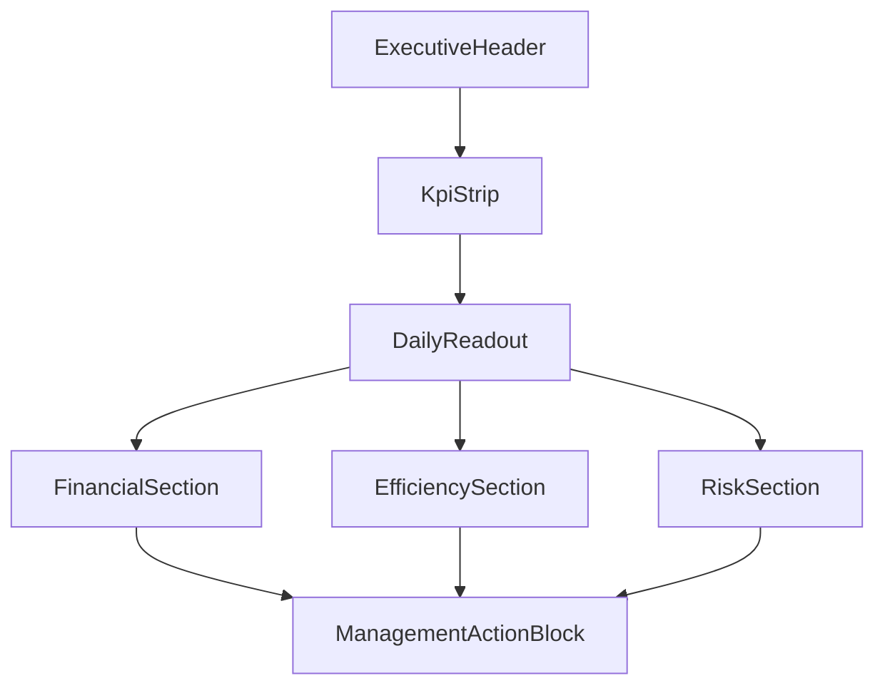

# Executive Dashboard Redesign Plan

## Objective
Transform the dashboard into an executive-grade decision interface: fewer redundant blocks, explicit decision narrative, and consistent KPI semantics across routes.

## Consolidated Diagnosis
- Redundant and non-functional UI blocks across multiple routes (for example, `Carteira` filter with no effective data impact in some pages).
- Inconsistent metric definitions (CPC vs conversion) and inconsistent ranking labels.
- Excessive chart density without explicit reading hierarchy (especially in analysis pages).
- Missing executive context layer (“what to decide now”) and weak risk-vs-return synthesis.

## Intervention Scope (all pages)
- [Home Page](c:\Users\Edson Vitor TI\Documents\dash relatorio\agecob-lens\src\pages\Index.tsx)
- [Productivity Analysis](c:\Users\Edson Vitor TI\Documents\dash relatorio\agecob-lens\src\pages\AnaliseProdutividade.tsx)
- [Agent Detail](c:\Users\Edson Vitor TI\Documents\dash relatorio\agecob-lens\src\pages\DetalhamentoAgentes.tsx)
- [Agent Comparison](c:\Users\Edson Vitor TI\Documents\dash relatorio\agecob-lens\src\pages\ComparacaoAgentes.tsx)
- [Current chart panels](c:\Users\Edson Vitor TI\Documents\dash relatorio\agecob-lens\src\components\charts)
- [Metric contract](c:\Users\Edson Vitor TI\Documents\dash relatorio\agecob-lens\src\services\api.ts)

## Proposed Information Architecture

### 1) Layer 1 (30-second executive answer)
- 4 to 6 fixed KPIs across all primary routes:
  - Financial output (`Σ valor_acordos`)
  - Immediate cash-in (`Σ valor_primeira_parcela`)
  - CPC (`contatos/acionamentos`)
  - Agreement conversion (`acordos/acionamentos`)
  - Average ticket (`valor_acordos/qtd_acordos`)
  - Exceptions (% over agreements or value)
- One “Daily Readout” block with 2 automatic bullets (insight + alert).

### 2) Layer 2 (visual explanation)
- Reduce chart count per page and keep at most 2–3 charts per section.
- Explicitly separate “Volume” and “Value” whenever units differ.
- Avoid repeated charts over the same ordering/base dimension.

### 3) Layer 3 (action)
- Top opportunities and risks in business language.
- BU highlights (AUTOS vs CONSUMER) for resource-allocation decisions.

## Target Architecture by Page (exact information distribution)

### Shared structural pattern (all pages)
- **Executive header (fixed):** page title + period + active filters summarized as chips.
- **KPI strip (row 1):** keep **all existing KPIs** per page, with visual hierarchy:
  - **Primary KPIs (highlighted):** Output, Cash-in, CPC, Conversion.
  - **Secondary KPIs (same row or row 2):** Ticket, Exceptions, and all other existing route indicators.
  - No current KPI is removed; only reordered and semantically standardized.
- **Daily Readout (row 2):** 1 wide card with:
  - 2 automatic insights (positive signal + risk alert)
  - 1 management action recommendation
- **Analytical body (row 3+):** maximum of 2 blocks per row, without repeating the same dimension in different visuals.

### Home Page ([Index](c:\Users\Edson Vitor TI\Documents\dash relatorio\agecob-lens\src\pages\Index.tsx))
- **Objective:** answer “how are we doing today?” in 20–30 seconds.
- **Final layout:**
  - Row 1: all existing home KPIs, with visual emphasis on the 4 decision KPIs.
  - Row 1B (if needed): continuation of complementary KPIs.
  - Row 2: “Daily Readout” card.
  - Row 3: 2 charts:
    - **Left:** BU outcome (AUTOS vs CONSUMER) with `valor_acordos` and `valor_primeira_parcela`.
    - **Right:** BU efficiency (CPC and conversion).
  - Row 4: one unified “Top 10 by agreed value” ranking with secondary `qtd_acordos` column.
- **Definitive removal:** duplicated rankings over identical ordering.

### Productivity Analysis ([AnaliseProdutividade](c:\Users\Edson Vitor TI\Documents\dash relatorio\agecob-lens\src\pages\AnaliseProdutividade.tsx))
- **Objective:** explain *why* the outcome happened.
- **Final layout by section:**
  - **Section A — Financial:** 2 charts (`valor_acordos` by portfolio/BU + top-N agent `valor_primeira_parcela`).
  - **Section B — Efficiency:** 2 charts (volume split from value metrics; conversion by BU).
  - **Section C — Risk/Quality:** 2 charts (exceptions by portfolio and by agent, using real exception data).
- **Organization rule:** keep only one chart panel (merge ideas from `AnaliseChartsPanel` and `DashboardV2ChartsPanel`).
- **Remove:** any synthetic exception proxy and any chart that repeats the same story.

### Agent Detail ([DetalhamentoAgentes](c:\Users\Edson Vitor TI\Documents\dash relatorio\agecob-lens\src\pages\DetalhamentoAgentes.tsx))
- **Objective:** provide individual performance drill-down without overloading with operational micro-data.
- **Final layout:**
  - Row 1: compact selected-agent summary (5 KPIs: agreements, value, CPC, conversion, ticket).
  - Row 2: 2 charts:
    - Volume (`acionamentos` / `contatos`)
    - Value (`1ª parcela` / `acordos`)
  - Row 3: “Today’s agreements” as a collapsible table (collapsed by default, expanded on demand).
- **Agent sidebar:** add search + top-N shortcuts; avoid long unstructured lists.
- **Redundancy rule:** do not duplicate contact/no-contact decomposition in both chart and table simultaneously.

### Agent Comparison ([ComparacaoAgentes](c:\Users\Edson Vitor TI\Documents\dash relatorio\agecob-lens\src\pages\ComparacaoAgentes.tsx))
- **Objective:** compare agents/groups for allocation and coaching decisions.
- **Final layout:**
  - Row 1: 4 comparative KPIs (best, worst, median, dispersion).
  - Row 2: primary scatter (`qtd_acionamentos` vs `valor_acordos`) for effort vs result.
  - Row 3: comparative table sorted by selected metric with relative variation.
  - Row 4: “Who to prioritize today” block (Top 3 opportunities + Top 3 risks).
- **Rule:** enforce one consistent CPC/conversion terminology, no competing formulas on the same page.

## Metric Architecture (single dictionary)

### Official Definitions
- **CPC:** `Σ qtd_contatos / Σ qtd_acionamentos`
- **Agreement conversion:** `Σ qtd_acordos / Σ qtd_acionamentos`
- **Average ticket:** `Σ valor_acordos / Σ qtd_acordos`
- **Exceptions (% value):** `Σ valor_excecoes / Σ valor_acordos`

### KPI Preservation Policy
- All KPIs currently present in the dashboard are preserved.
- Redesign scope is limited to:
  - reading order;
  - priority grouping;
  - label/unit clarity;
  - visual redundancy removal (not indicator removal).

### Presentation Rules
- Every metric must expose:
  - short label (card),
  - standardized formula (tooltip),
  - explicit unit (BRL, %, count).
- Forbid ambiguous labels such as “Conversion Rate” without formula context.

## Component Blueprint (implementation)

### New reusable components
- `ExecutiveKpiStrip` (standard KPI strip for primary routes)
- `ExecutiveInsightCard` (2 insights + 1 action)
- `SectionHeader` (title + description + unit)
- `ExecutiveRankingTable` (single ranking with primary + secondary columns)

### Existing components to refactor
- [AnaliseChartsPanel](c:\Users\Edson Vitor TI\Documents\dash relatorio\agecob-lens\src\components\charts\AnaliseChartsPanel.tsx)
- [DashboardV2ChartsPanel](c:\Users\Edson Vitor TI\Documents\dash relatorio\agecob-lens\src\components\charts\DashboardV2ChartsPanel.tsx)
- [DetalhamentoChartsPanel](c:\Users\Edson Vitor TI\Documents\dash relatorio\agecob-lens\src\components\charts\DetalhamentoChartsPanel.tsx)
- [AgentComparisonDashboard](c:\Users\Edson Vitor TI\Documents\dash relatorio\agecob-lens\src\components\AgentComparisonDashboard.tsx)

## Target Executive Reading Flow

## Wave-based Execution Plan

### Wave A — Consistency and Clarity (high immediate impact)
- Standardize metric dictionary and terminology (CPC, conversion, ticket, exceptions).
- Fix inconsistent labels (rankings/titles not aligned with actual ordering).
- Remove or hide non-functional controls (or connect them to actual filtering).

### Wave B — Page-level Content Reorganization
- **Index:** keep executive synthesis + one non-duplicated ranking block.
- **Analysis:** consolidate duplicated panels into “Financial”, “Efficiency”, and “Risk” sections.
- **Detail:** move agent summary to the top and demote detailed table to secondary level.
- **Comparison:** align effective filters and unify conversion/CPC semantics.

### Wave C — Additional Executive Value (no backend contract change)
- Add derived KPIs already available in frontend data:
  - Exceptions/agreed-value ratio
  - Result concentration (Top 3 over total)
  - Average productivity per agent
- Add “Management Signal” block with objective recommendations (for example: BU focus, exception policy review, portfolio redistribution).

## Success Criteria (acceptance)
- Every page clearly answers: “result”, “efficiency”, and “risk” with no formula ambiguity.
- No redundant card/chart in the same viewport context.
- No visible filter without real data impact.
- Executive reading path completed in <= 1 minute per page.

## Risks and Dependencies
- Trend/target views require historical series (outside initial wave scope).
- Business validation required for aggregations involving average metrics (`acordo_medio`, `desconto_medio_percentual`, `parcelamento_medio`).
- Exception handling must be reviewed to ensure real data usage (no synthetic proxies).
