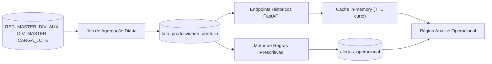

# Pipeline — Análise Operacional

Documento de referência para a área **Análise Operacional** (substituto do placeholder atual em [src/pages/AnaliseProfunda.tsx](../../src/pages/AnaliseProfunda.tsx)).

Este é o source of truth conceitual e técnico da área. Os contratos de endpoint e o mapa de KPIs aqui descritos estão programados para fases futuras. Nenhuma query SQL de produção é incluída neste documento para as seções conceituais (mesmo padrão de "placeholder mode" usado em [missing-endpoints-contracts.md](../specs/missing-endpoints-contracts.md)) — exceto na seção 9, onde queries validadas em produção são registradas.

Última atualização: **2026-04-24** (validação de infraestrutura + decisões técnicas incorporadas).

---

## 1. Contexto e Escopo

O dashboard atual ([Index.tsx](../../src/pages/Index.tsx), [ComparacaoAgentes.tsx](../../src/pages/ComparacaoAgentes.tsx), [AnaliseProdutividade.tsx](../../src/pages/AnaliseProdutividade.tsx), [DetalhamentoAgentes.tsx](../../src/pages/DetalhamentoAgentes.tsx)) opera estritamente sobre uma **janela do dia atual** (regra global `@Hoje <= data < @Amanhã`, ver [mapa-kpis-dashboard.md](../specs/mapa-kpis-dashboard.md)). Responde "como estamos agora?" e é projetado para resposta operacional imediata.

**Análise Operacional** é uma camada paralela (não substituta) para decisões de médio prazo:

- Janela longa (semanas / meses / anos).
- Cortes multifatoriais (portfólio × hora × dia da semana × mês).
- Detecção de padrões, não reporte de eventos isolados.
- Saídas orientadas a ação (coaching, realocação, alertas), não apenas métricas descritivas.

### Escopo e Limites

Esta área **não substitui** as páginas existentes. Para status do dia, `Index` continua sendo o ponto de entrada correto. A Análise Operacional é para perguntas que requerem uma janela maior que um dia.

### Nota de Nomenclatura

"Análise Operacional" sobrepõe parcialmente as páginas existentes que também são operacionais. O nome foi escolhido para enfatizar que a saída pretendida é **orientação operacional** (coaching, realocação, priorização). Alternativas consideradas: "Análise Histórica", "Inteligência Operacional", "Análise Estratégica". Nomenclatura final ainda pendente (ver seção 11).

### Referência Cruzada

O redesign do dashboard executivo do dia é definido em [redesign-executivo.md](redesign-executivo.md). Ambos os documentos compartilham o mesmo dicionário de métricas e devem ser versionados juntos.

---

## 2. Modelo de Três Níveis (pirâmide analítica)

Adaptado da pirâmide analítica clássica (Gartner) para o domínio de cobranças:

| Nível | Pergunta respondida | Exemplo no domínio |
|---|---|---|
| **Descritivo** | "O que aconteceu?" | "Fechamos 50 acordos de 500 contatos no mês" |
| **Diagnóstico** | "Por que aconteceu?" | "Conversão cai 30% após as 16h; agente X tem 0% de conversão por 5 dias" |
| **Prescritivo** | "O que fazer?" | "Realocar agentes do turno da tarde, coaching para X, priorizar portfólio Y" |

O quarto nível clássico (Preditivo — "o que vai acontecer?") está **fora do escopo inicial**. Modelos estatísticos/ML são considerados apenas na fase 5 do roadmap se o ROI justificar.

### Organização na UI

Os três níveis são apresentados como **seções verticais dentro da mesma página**, ordenadas pelo fluxo de raciocínio (descritivo → diagnóstico → prescritivo), não em abas separadas. Separação por aba fragmentaria o caminho de raciocínio.

---

## 3. Mapa de KPIs por Nível Analítico

Formato seguindo [mapa-kpis-dashboard.md](../specs/mapa-kpis-dashboard.md). Queries de produção permanecem como `TODO: BUSINESS_QUERY_REQUIRED` até validação de negócio.

### 3.1 Descritivo

| KPI | Fórmula conceitual | Agregação temporal | Endpoint proposto | Fonte primária |
|---|---|---|---|---|
| `acionamentos_serie` | `COUNT(DISTINCT ID_CTO_MASTER)` por período | dia / semana / mês | `/dashboard/operacional/descritivo/{db}` | `CTO_MASTER` |
| `contatos_serie` | `COUNT(DISTINCT ID_CTO_MASTER WHERE CPC)` por período | dia / semana / mês | mesmo | `CTO_MASTER` |
| `cpc_historico` | `contatos_serie / acionamentos_serie * 100` | dia / semana / mês | mesmo | derivado |
| `acordos_serie` | `COUNT(DISTINCT NR_RECEBIMENTO WHERE aprovado)` por período | dia / semana / mês | mesmo | `REC_MASTER` |
| `valor_acordos_serie` | `SUM(valor_total_acordo WHERE aprovado)` por período | dia / semana / mês | mesmo | `REC_MASTER` |
| `ticket_medio_historico` | `AVG(valor_total_acordo WHERE aprovado)` por período | mês | mesmo | `REC_MASTER` |
| `taxa_conversao_historica` | `acordos_serie / acionamentos_serie * 100` | dia / semana / mês | mesmo | derivado |
| `excecoes_serie` | `COUNT(DISTINCT NR_RECEBIMENTO WHERE status=11)` | dia / semana / mês | mesmo | `REC_MASTER` |
| `primeira_parcela_serie` | `SUM(VALOR WHERE PARCELA=0 AND aprovado)` | dia / semana / mês | mesmo | `REC_MASTER` |
| `desconto_medio_historico` | `AVG(valor_total_acordo / VR_ORIGINAL * 100)` | mês | mesmo | `REC_MASTER` + `REC_DIVIDAS` + `DIV_MASTER` |

### 3.2 Diagnóstico

| KPI / Corte | Pergunta respondida | Endpoint proposto | Fonte |
|---|---|---|---|
| `conversao_por_hora` | "Em quais horários convertemos melhor/pior?" | `/dashboard/operacional/diagnostico/{db}?corte=hora` | `CTO_MASTER` + `REC_MASTER` |
| `conversao_por_dia_semana` | "Segunda é mais fraca que sexta?" | `/dashboard/operacional/diagnostico/{db}?corte=dia_semana` | `CTO_MASTER` + `REC_MASTER` |
| `portfolios_em_queda` | "Quais portfólios estão perdendo performance?" | `/dashboard/operacional/diagnostico/{db}?corte=portfolio` | `REC_MASTER` + `DIV_AUX.CAMPO010` |
| `comparativo_mes_vs_mes` | "Mês atual vs. mês anterior?" | `/dashboard/operacional/diagnostico/{db}?corte=mes_vs_mes` | fato agregado |
| `sazonalidade_primeira_parcela` | "Em quais dias a concentração de 1ª parcela é maior?" | `/dashboard/operacional/diagnostico/{db}?corte=sazonalidade` | `REC_MASTER` |
| `correlacao_esforco_conversao` | "Mais esforço converte em acordos?" | `/dashboard/operacional/diagnostico/{db}?corte=correlacao` | derivado |
| `comparativo_bu` | "Como AUTOS e CONSUMER divergem ao longo do tempo?" | `/dashboard/operacional/diagnostico/{db}?corte=bu` | fato agregado |

> **Nota (decisão 2026-04-24):** Os cortes por agente (`agentes_fora_da_media`, `dispersao_agentes`, `cohort_tenure`, `eficiencia_marginal_agente`) foram movidos para **fora do escopo da fase 1** — ver seção 8.1. Podem ser implementados em fase futura com tabela fato separada `fato_produtividade_agente`.

**Detecção de anomalias** (opcional, fase 3 avançada): flag estilo z-score simples (valores fora de ±2σ sobre baseline móvel de 30 dias). Sem ML no escopo inicial.

**Detecção de drift** (fase 3): comparação da média da janela atual vs. janela anterior com teste de significância (t-test de duas amostras ou Welch's). Se `p < 0.05`, sinalizar a métrica como `drifting`. Alimenta diretamente as regras prescritivas (ex.: `alerta_portfolio_em_risco` pode usar drift detection ao invés de threshold fixo de 20%).

### 3.3 Prescritivo

Regras são **determinísticas e auditáveis**. Cada regra segue: condição → severidade → ação recomendada.

| Regra | Condição | Severidade | Ação recomendada |
|---|---|---|---|
| `sinal_realocacao_turno` | Queda de conversão > 30% após 16h por >= 5 dias úteis | média | Realocar capacidade do turno ou revisar horário de contato |
| `alerta_portfolio_em_risco` | Portfólio com queda >= 20% de acordos mês a mês (ou drift p < 0.05) | alta | Revisar estratégia do portfólio e política de contato |
| `excesso_excecoes_agente` | Agente com `qtd_excecoes / qtd_acordos > X%` na janela mensal | média | Auditoria da política de exceções |
| `desconto_fora_do_padrao` | Desconto médio do agente > 1.5× baseline do escritório | média | Revisão de alçada de desconto |
| `concentracao_primeira_parcela` | > 80% da concentração de 1ª parcela em < 20% dos portfólios | baixa | Redistribuição de carteira |

> **Regras por agente** (`flag_coaching_agente`, `baixo_aproveitamento_cpc`, `eficiencia_marginal_saturada`) ficam fora do escopo da fase 1 pela mesma razão dos cortes diagnósticos — ver seção 8.1.

Parâmetros `X`, tamanhos de janela e thresholds devem ser externalizados em um **asset de configuração separado** para que o negócio possa ajustar sem deploy. Ver seção 4.4.

---

## 4. Pipeline de Dados



### 4.1 Justificativa de Estágios

- **Job de agregação diária**: queries de 12+ meses diretamente em `REC_MASTER` são inviáveis em latência e carga. O job roda uma vez por dia, fora do horário comercial.
- **Tabela fato `fato_produtividade_portfolio`**: grão mínimo é dia × portfólio × banco. Isso habilita fatiamento arbitrário sem reler tabelas transacionais. Ver estrutura completa na seção 9.1.
- **Endpoints históricos**: leem **apenas** da camada fato, nunca das fontes brutas — latência previsível de API.
- **Cache in-memory (TTL curto)**: acessos repetidos à mesma janela justificam TTL de 5–15 minutos.
- **Motor de regras prescritivas**: isolado do endpoint descritivo; consome a camada fato, aplica as regras da seção 3.3, persiste alertas.
- **Tabela de alertas ativos**: estado persistente com timestamps, status (`ativo` / `resolvido` / `ignorado`) e severidade para auditabilidade e revisão histórica.

### 4.2 Mapeamento Fonte → Destino

| Fonte | Campos relevantes | Destino na camada fato |
|---|---|---|
| `REC_MASTER` | `NR_RECEBIMENTO`, `ID_REC_STATUS`, `DT_EMISSAO`, `VALOR` | `qtd_acordos`, `qtd_excecoes`, `valor_acordos` |
| `REC_DIVIDAS` + `DIV_AUX.CAMPO010` | portfólio | dimensão portfólio |
| `CARGA_LOTE` | `DATA`, `QTD_CLI`, `ID_CARTEIRA` | marcadores de evento de reshuffle (ver seção 10) |

> **Fora da fase 1:** `CTO_MASTER` (acionamentos/contatos por agente), `USU_MASTER` (dimensão agente), `REC_DIVIDAS` + `DIV_MASTER` (desconto).

### 4.3 Regras de Exclusão Herdadas

Preservar as regras de exclusão atuais do backend ([main.py](../../main.py)): agentes `COBDESANTOS`, `NEMBUSUSER` e prefixos `ANTLIA%` / `INTERNA%`. Essas exclusões devem rodar no **job de agregação** (não em queries de leitura) para manter outputs consistentes entre páginas.

### 4.4 Contrato de Configuração de Regras

Parâmetros das regras prescritivas devem ser externalizados. Schema proposto em YAML:

```yaml
# backend/rules/operacional.yaml
version: 1
rules:
  sinal_realocacao_turno:
    enabled: true
    conversion_drop_threshold_pct: 30
    hour_cutoff: 16                 # 16h
    min_business_days: 5
    severity: medium

  alerta_portfolio_em_risco:
    enabled: true
    decline_threshold_pct: 20
    use_drift_detection: false      # alternar para true quando drift detection implementado
    drift_p_value: 0.05
    severity: high

  excesso_excecoes_agente:
    enabled: true
    exception_rate_threshold_pct: 15  # X
    window_days: 30
    severity: medium

  desconto_fora_do_padrao:
    enabled: true
    multiplier_vs_baseline: 1.5
    severity: medium

  concentracao_primeira_parcela:
    enabled: true
    agent_pct_threshold: 20          # < 20% dos portfólios
    value_pct_threshold: 80          # > 80% do valor
    severity: low
```

**Padrão de acesso:**
- Motor de regras carrega config no startup.
- `GET /admin/rules-config` retorna configuração ativa (read-only, requer auth admin).
- `POST /admin/rules-config/reload` força reload do arquivo (auth admin).
- Futuro: migrar para tabela de banco para edição via UI.

**Versionamento:** campo `version` incrementa em qualquer mudança. Motor loga versão ativa em cada execução.

### 4.5 Contrato de Freshness

O envelope de resposta de todos os endpoints históricos deve incluir campo `freshness` no `meta`:

```json
{
  "meta": {
    "generated_at": "ISO-8601",
    "last_aggregation_at": "ISO-8601",
    "freshness_status": "fresh|stale",
    "total_rows": 0,
    "sources": ["fato_produtividade_portfolio"],
    "filters": {}
  },
  "data": [],
  "errors": []
}
```

**Comportamento no frontend:**
- Se `freshness_status === "stale"` → banner amarelo: "Dados atualizados até {last_aggregation_at}. Agregação diária pode estar pendente."
- Se `last_aggregation_at` é null → "Status de atualização indisponível."

### 4.6 Ciclo de Vida dos Alertas

Alertas em `alertas_operacional` seguem uma máquina de estados:

```
[novo] → ativo → resolvido
                ↘ ignorado

Transições:
- ativo → resolvido:  AUTOMÁTICA quando a condição gatilho não é mais verdadeira
                      na próxima execução do motor de regras.
- ativo → ignorado:   MANUAL pelo gestor via ação na UI ("descartar alerta").
- ignorado → ativo:   NÃO permitido. Uma vez ignorado, permanece assim para aquela instância.
                      Um novo alerta é criado se a condição re-acionar.
```

**Política de retenção:** alertas resolvidos e ignorados são retidos por 90 dias (configurável em `operacional.yaml`), depois arquivados ou deletados por um job de limpeza. Alertas ativos nunca são auto-deletados.

---

## 5. Contratos de Endpoints

Seguindo o mesmo padrão "placeholder mode" de [missing-endpoints-contracts.md](../specs/missing-endpoints-contracts.md). SQL permanece `TODO: BUSINESS_QUERY_REQUIRED` exceto onde indicado como validado.

### 5.1 Descritivo

- **Endpoint**: `GET /dashboard/operacional/descritivo/{database_name}`
- **Finalidade**: série temporal de longa janela para KPIs primários.

**Parâmetros de query:**
- `start_date` (obrigatório, `YYYY-MM-DD`)
- `end_date` (obrigatório, `YYYY-MM-DD`)
- `interval` (opcional, default `month`: `day | week | month`)
- `assessoria` (opcional)

**Contrato de resposta:**
```json
{
  "meta": {
    "generated_at": "ISO-8601",
    "last_aggregation_at": "ISO-8601",
    "freshness_status": "fresh|stale",
    "total_rows": 0,
    "sources": ["fato_produtividade_portfolio"],
    "filters": { "start_date": "YYYY-MM-DD", "end_date": "YYYY-MM-DD", "interval": "month" }
  },
  "data": [
    {
      "period": "YYYY-MM",
      "portfolio": "string",
      "banco_origem": "CONSUMER|AUTOS",
      "qtd_acordos": 0,
      "valor_acordos": 0.0,
      "taxa_conversao": 0.0,
      "ticket_medio": 0.0,
      "qtd_excecoes": 0
    }
  ],
  "errors": []
}
```

> **Nota:** sobreposição intencional com `/dashboard/produtividade-historico/{db}` já definido em [missing-endpoints-contracts.md](../specs/missing-endpoints-contracts.md). Decisão pendente: **unificar** em um único endpoint (preferido) ou manter ambos — ver seção 11, item 3.

### 5.2 Diagnóstico

- **Endpoint**: `GET /dashboard/operacional/diagnostico/{database_name}`
- **Finalidade**: visões seccionais explicando a variação do nível descritivo.

**Parâmetros de query:**
- `start_date` (obrigatório)
- `end_date` (obrigatório)
- `corte` (obrigatório: `hora | dia_semana | portfolio | mes_vs_mes | sazonalidade | correlacao | bu`)
- `assessoria` (opcional)

**Envelope de resposta** (shape de `data` varia por `corte`; envelope permanece estável):
```json
{
  "meta": {
    "generated_at": "ISO-8601",
    "last_aggregation_at": "ISO-8601",
    "freshness_status": "fresh|stale",
    "total_rows": 0,
    "sources": ["fato_produtividade_portfolio"],
    "filters": { "corte": "hora" }
  },
  "data": [
    {
      "dimensao_label": "string",
      "dimensao_valor": "string",
      "qtd_acordos": 0,
      "valor_acordos": 0.0,
      "taxa_conversao": 0.0,
      "desvio_vs_media": 0.0,
      "drift_detected": false
    }
  ],
  "errors": []
}
```

#### `corte=bu` — shape específico

```json
{
  "data": [
    {
      "dimensao_label": "AUTOS",
      "dimensao_valor": "COBwebRCBAUTOS",
      "period": "YYYY-MM",
      "qtd_acordos": 0,
      "valor_acordos": 0.0,
      "taxa_conversao": 0.0,
      "ticket_medio": 0.0,
      "desvio_vs_media": 0.0
    }
  ]
}
```

### 5.3 Prescritivo

- **Endpoint**: `GET /dashboard/operacional/prescritivo/{database_name}`
- **Finalidade**: retornar alertas/recomendações ativas geradas pelo motor de regras.
- **Status**: `TODO: RULES_ENGINE_PENDING`

**Parâmetros:**
- `severidade` (opcional: `alta | media | baixa`)
- `status` (opcional, default `ativo`: `ativo | resolvido | ignorado`)
- `assessoria` (opcional)

**Contrato de resposta:**
```json
{
  "data": [
    {
      "alerta_id": "string",
      "regra": "alerta_portfolio_em_risco",
      "severidade": "alta",
      "status": "ativo",
      "titulo": "string",
      "descricao": "string",
      "acao_sugerida": "string",
      "entidade_tipo": "portfolio|escritorio",
      "entidade_id": "string",
      "entidade_nome": "string",
      "metrica_gatilho": 0.0,
      "criado_em": "ISO-8601",
      "dados_referencia": { "link_diagnostico": "string" }
    }
  ]
}
```

O campo `dados_referencia.link_diagnostico` aponta para o endpoint diagnóstico que suporta o gatilho da regra, habilitando navegação inversa (prescritivo → diagnóstico) na UI.

### 5.4 Transição de Estado de Alerta

- **Endpoint**: `PATCH /dashboard/operacional/prescritivo/{database_name}/alertas/{alerta_id}`
- **Finalidade**: gestor pode descartar (ignorar) um alerta.
- **Body**: `{ "status": "ignorado" }`
- **Auth**: requer auth nível admin (mesmo `x-api-key` + `Authorization` existente).

---

## 6. Proposta de Interface

Página alvo: `src/pages/AnaliseOperacional.tsx`.

### 6.1 Estrutura da Página

```
+---------------------------------------------------------------+
| Header: "Análise Operacional" + SidebarTrigger                |
+---------------------------------------------------------------+
| Filtros fixos:                                                 |
|   [ Período: Mês atual / 3m / 6m / Custom ]                   |
|   [ Banco: Todos / AUTOS / CONSUMER ]                         |
|   [ Assessoria: opcional ]                                    |
+---------------------------------------------------------------+
| Banner de freshness (condicional — apenas se stale)           |
+---------------------------------------------------------------+
| Seção 1 — DESCRITIVO ("O que aconteceu?")                     |
|   Cards KPI agregados por período                             |
|   Gráfico de série temporal (linhas + barras compostas)       |
|   Comparativo período atual vs. período anterior             |
+---------------------------------------------------------------+
| Seção 2 — DIAGNÓSTICO ("Por que aconteceu?")                  |
|   Abas internas por corte: Hora | Dia da semana |            |
|                   Portfólio | Mês vs. mês | Correlação |      |
|                   Comparativo BU                              |
|   Gráfico + tabela para o corte selecionado                  |
|   Destaque de outlier (± 2 sigma)                            |
+---------------------------------------------------------------+
| Seção 3 — PRESCRITIVO ("O que fazer?")                        |
|   Lista de alertas agrupada por severidade                   |
|   Cada card: título + descrição + ação sugerida +            |
|              botão "ver diagnóstico" (drill-up inverso) +    |
|              botão "ignorar" (→ ignorado)                    |
+---------------------------------------------------------------+
```

### 6.2 Especificação Visual dos Gráficos

#### Descritivo — Série Temporal

| Atributo | Valor |
|---|---|
| **Tipo** | `ComposedChart` (Recharts) |
| **Eixo X** | Labels de período (meses, semanas ou dias conforme `interval`) |
| **Barras** | `valor_acordos` (green-600) + `qtd_excecoes` (red-400), empilhadas |
| **Linhas** | `taxa_conversao` (amber-500, eixo Y direito %) |
| **Eixo Y esq.** | BRL (barras financeiras) |
| **Eixo Y dir.** | Percentual (linhas de eficiência) |

#### Descritivo — Atual vs. Período Anterior

| Atributo | Valor |
|---|---|
| **Tipo** | `BarChart` — barras agrupadas |
| **Barras** | 2 por KPI: `anterior` (opacidade 50%) + `atual` (cor cheia) |
| **Labels** | Anotação delta acima da barra atual: `+12%` ou `-8%` |

#### Diagnóstico — corte=hora / dia_semana

| Atributo | Valor |
|---|---|
| **Tipo** | `BarChart` — barras verticais |
| **Eixo X** | Horas (8h–18h) ou dias da semana (Seg–Sex) |
| **Linha de referência** | Média diária/semanal (tracejado) |
| **Destaque de anomalia** | Barras fora de ±2σ recebem preenchimento red-500 |

#### Diagnóstico — corte=portfolio

| Atributo | Valor |
|---|---|
| **Tipo** | `BarChart` — barras horizontais divergentes |
| **Eixo Y** | Nomes de portfólio, ordenados por magnitude de queda |
| **Eixo X** | % de variação mês a mês |
| **Barras** | Divergentes: verde para crescimento, vermelho para queda |
| **Flag de drift** | Ícone 🔴 ao lado do nome se `drift_detected === true` |

#### Diagnóstico — corte=bu

| Atributo | Valor |
|---|---|
| **Tipo** | `ComposedChart` — dual linha |
| **Linhas** | 2 linhas: AUTOS (azul-600 sólido) + CONSUMER (azul-400 sólido) |
| **Interação** | Seletor de métrica acima do gráfico para alternar eixo Y |
| **Suplementar** | Gráfico de barras agrupadas abaixo mostrando valores absolutos do período selecionado |

#### Diagnóstico — corte=correlacao

| Atributo | Valor |
|---|---|
| **Tipo** | `ScatterChart` |
| **Eixo X** | `qtd_acionamentos` (esforço) |
| **Eixo Y** | `taxa_conversao` (%) |
| **Pontos** | 1 por portfólio-dia, colorido por banco |

#### Prescritivo — Lista de Alertas

| Atributo | Valor |
|---|---|
| **Tipo** | Lista de cards estruturados (não gráfico) |
| **Agrupamento** | Por severidade: alta (topo, borda esquerda vermelha) → média (âmbar) → baixa (azul) |
| **Conteúdo do card** | Título, descrição, `acao_sugerida`, nome da entidade, valor de `metrica_gatilho` |
| **Ações** | Botão "Ver diagnóstico" + Botão "Ignorar" |
| **Estado vazio** | "Nenhum alerta ativo. Operação dentro dos parâmetros." |

### 6.3 Regras de UX

- **Ordem fixa** (descritivo → diagnóstico → prescritivo): fluxo de raciocínio analítico; sem abas de nível superior.
- **Drill-up inverso**: cada alerta prescritivo linka de volta para a visão diagnóstica de suporte.
- **Reutilização do modelo de filtros existente**: `DatabaseOption` é reutilizado (ver [AnaliseProdutividade.tsx](../../src/pages/AnaliseProdutividade.tsx)).
- **Carregamento incremental**: cada seção carrega independentemente.
- **Estados vazios explícitos**: cada seção exibe estado claro de sem-dados/sem-alerta.
- **Banner de freshness**: mostrado no topo da página quando `freshness_status === "stale"`. Dismissível por sessão.

### 6.4 Componentes Reutilizáveis

- `ExecutiveKpiStrip` — cards KPI da seção descritiva.
- `SectionHeader` — títulos de seção.
- `HorizontalRankingChart`, `BuEfficiencyChart` — baseline visual do painel diagnóstico.
- Types e helpers de `src/services/api.ts`.

---

## 7. Roadmap de Implementação

| Fase | Escopo | Entregáveis | Dependências |
|---|---|---|---|
| **0** | Conceitual (este doc) | `pipeline-analise-operacional_v2.md` aprovado | — |
| **1** | Backend descritivo | Tabela `fato_produtividade_portfolio` + job de agregação + endpoint `/operacional/descritivo/{db}` + metadata de freshness | Permissão de criação de tabela no banco Agecob DB |
| **2** | Frontend descritivo | Renomear `AnaliseProfunda.tsx` → `AnaliseOperacional.tsx`; atualizar rota em [App.tsx](../../src/App.tsx) e label no sidebar [AppSidebar.tsx](../../src/components/AppSidebar.tsx); implementar seção descritiva | Fase 1 completa |
| **3** | Diagnóstico | Endpoint `/operacional/diagnostico/{db}` (todos os cortes) + componente `DiagnosticoChartsPanel` | Fase 1 (tabela fato) |
| **3b** | Detecção de drift | Módulo de comparação estatística no motor de regras; flag `drift_detected` na resposta do diagnóstico | Fase 3 |
| **4** | Prescritivo | Motor de regras (config YAML + job) + tabela `alertas_operacional` + ciclo de vida de alertas + endpoint `/operacional/prescritivo/{db}` + UI de alertas + drill-up inverso | Fase 3 |
| **5** *(opcional)* | Evolução estatística/ML | Forecasting de curto prazo, detecção de anomalias por modelo | Validação de ROI após fase 4 |

Cada fase é independentemente valiosa. No final da fase 2, a área já entrega valor significativo sem requerer as fases seguintes.

---

## 8. Validação de Infraestrutura (2026-04-24)

### 8.1 Índices Confirmados

Verificação realizada antes de qualquer implementação nas tabelas de maior volume.

**`COBwebRCBCONSUMER..REC_MASTER`**

| Índice | Cobertura |
|---|---|
| `PK_REC_MASTER` | chave primária |
| `IND_REC_MASTER_DT_EMISSAO` | queries históricas por data de acordo ✓ |
| `IND_REC_MASTER_DT_PAGAMENTO` | queries por data de pagamento ✓ |
| `IND_REC_MASTER_DT_VENCIMENTO` | queries por vencimento ✓ |
| `IND_REC_MASTER_NR_RECEBIMENTO` | joins com `REC_DIVIDAS` ✓ |

**`COBwebRCBCONSUMER..CTO_MASTER`**

| Índice | Cobertura |
|---|---|
| `PK_CTO_MASTER` | chave primária |
| `IND_CTO_MASTER_DATA` | queries históricas por data de acionamento ✓ |
| `IND_CTO_MASTER_ID_USUARIO` | joins com agentes ✓ |

**Conclusão:** a infraestrutura existente é suficiente para o pipeline inteiro. Nenhum índice adicional é necessário antes da fase 1.

### 8.2 Testes de Performance — 6 Meses de Histórico

Queries executadas contra `COBwebRCBCONSUMER` no servidor de produção (Intel Xeon, 16GB RAM).

| Query | Janela | Tempo | Resultado |
|---|---|---|---|
| `CTO_MASTER` agregado por dia | 6 meses | ~5s | ✓ viável |
| `REC_MASTER` agregado por dia | 6 meses | <1s | ✓ viável |
| Join incorreto (linha × linha) | 6 meses | ~81s | ✗ inviável |
| **CTEs separadas + join de agregados** | **6 meses** | **~1s** | **✓ padrão confirmado** |
| `REC_MASTER` + `DIV_AUX` (portfólio) | 6 meses | ~2s | ✓ viável (já em produção) |

> **Lição registrada:** o join entre `CTO_MASTER` e `REC_MASTER` deve sempre ser feito entre **agregados** (CTE por CTE), nunca linha a linha. Join direto causa produto cartesiano implícito e degrada 81× o tempo.

### 8.3 Estimativa para Janela Trimestral

Com base nos tempos de 6 meses, a janela inicial de 3 meses deve rodar em menos de 1 segundo por CTE. O job de agregação diária completo — incluindo join e gravação na tabela fato — deve terminar em menos de 10 segundos, viável para execução fora do horário comercial.

### 8.4 Banco AUTOS

`COBwebRCBAUTOS` tem estrutura idêntica ao `COBwebRCBCONSUMER`. As queries validadas aqui se aplicam diretamente, sem adaptação.

---

## 9. Estrutura da Tabela Fato e Query de Agregação

### 9.1 Tabela Fato — `fato_produtividade_portfolio`

**Granularidade:** dia × portfólio × banco.

```sql
CREATE TABLE fato_produtividade_portfolio (
    id                  BIGINT IDENTITY(1,1) PRIMARY KEY,
    dia                 DATE NOT NULL,
    portfolio           VARCHAR(255) NOT NULL,
    banco_origem        VARCHAR(20) NOT NULL,     -- 'CONSUMER' ou 'AUTOS'
    qtd_acordos         INT NOT NULL DEFAULT 0,
    valor_acordos       DECIMAL(18,2) NOT NULL DEFAULT 0,
    qtd_excecoes        INT NOT NULL DEFAULT 0,
    dt_atualizacao      DATETIME NOT NULL DEFAULT GETDATE()
)
```

> **Status:** estrutura definida. Criação pendente de confirmação de permissão no banco de destino (Agecob DB). **Não criar** em `COBwebRCBCONSUMER` nem em `COBwebRCBAUTOS`.

### 9.2 Query Base do Job de Agregação

Query validada em produção. Serve como base para o job de agregação diária.

```sql
-- Executar para cada banco: COBwebRCBCONSUMER e COBwebRCBAUTOS
-- Substituir {DB} pelo nome do banco e {BANCO_ORIGEM} por 'CONSUMER' ou 'AUTOS'

WITH CTE_Acordos AS (
    SELECT
        CAST(R.DT_EMISSAO AS DATE)              AS dia,
        CA.CAMPO010                             AS portfolio,
        COUNT(DISTINCT R.NR_RECEBIMENTO)        AS qtd_acordos,
        SUM(R.VALOR)                            AS valor_acordos,
        COUNT(DISTINCT CASE
            WHEN R.ID_REC_STATUS = 11
            THEN R.NR_RECEBIMENTO END)          AS qtd_excecoes
    FROM {DB}..REC_MASTER R (NOLOCK)
    CROSS APPLY (
        SELECT TOP 1 DA.CAMPO010
        FROM {DB}..REC_DIVIDAS RD (NOLOCK)
        JOIN {DB}..DIV_AUX DA (NOLOCK)
            ON DA.ID_DIVIDA = RD.ID_DIVIDA
        WHERE RD.NR_RECEBIMENTO = R.NR_RECEBIMENTO
    ) CA
    WHERE R.DT_EMISSAO >= DATEADD(MONTH, -3, GETDATE())  -- carga inicial; job incremental usa CAST(GETDATE() AS DATE)
      AND R.ID_REC_STATUS IN (1, 3, 5, 12)
    GROUP BY CAST(R.DT_EMISSAO AS DATE), CA.CAMPO010
)
SELECT
    dia,
    portfolio,
    '{BANCO_ORIGEM}'        AS banco_origem,
    qtd_acordos,
    valor_acordos,
    qtd_excecoes,
    GETDATE()               AS dt_atualizacao
FROM CTE_Acordos
ORDER BY dia, portfolio
```

**Notas de implementação:**
- `CROSS APPLY TOP 1` preservado — mesmo padrão do `main.py`, evita multiplicação de linhas quando um acordo cobre múltiplas dívidas.
- `NOLOCK` em todas as tabelas — requisito dos DBAs da Agecob.
- A janela `DATEADD(MONTH, -3, GETDATE())` é para a **carga inicial**. O job incremental diário deve usar `CAST(GETDATE() AS DATE)` para reprocessar apenas o dia anterior.

---

## 10. Contexto de Cargas e Reshuffles

Durante a validação, foi descoberta a tabela `CARGA_LOTE` — registro de todos os eventos de importação de carteiras. Este contexto é necessário para interpretar variações históricas nos gráficos da análise operacional (um pico de acordos pode ser explicado por entrada de nova carteira, não por melhora de performance).

### 10.1 Origem dos Dados

| Campo | Descrição |
|---|---|
| `DATA` | data e hora da importação |
| `ARQUIVO` | nome do arquivo importado |
| `QTD_CLI` | total de clientes no lote |
| `QTD_NV_CLI` | clientes genuinamente novos no lote |
| `QTD_TEL` / `QTD_NV_TEL` | total / novos telefones |
| `QTD_EMAIL` / `QTD_NV_EMAIL` | total / novos e-mails |
| `ID_CARTEIRA` | carteira de destino |

> Um lote pode conter simultaneamente clientes novos e clientes realocados de outras carteiras. `QTD_NV_CLI` já separa os dois — não confundir volume alto com "tudo novo".

### 10.2 Classificação de Eventos

Distribuição de `QTD_CLI` nos lotes históricos (137 lotes, `ID_USUARIO = 1`):

| Estatística | Valor |
|---|---|
| Mínimo | 1 |
| Mediana | 53 |
| P75 | 178 |
| P90 | 6.522 |
| P95 | 45.440 |
| Máximo | 99.748 |

| Tipo de evento | Critério |
|---|---|
| Carga rotineira | `QTD_CLI <= 500` |
| Carga relevante | `QTD_CLI > 500` e `<= 10.000` |
| Evento de reshuffle | `QTD_CLI > 10.000` |

Esses thresholds devem ser usados como **marcadores visuais nos gráficos históricos** — sinalizando ao usuário quando uma variação de volume é explicada por entrada de nova carteira, não por mudança de performance.

### 10.3 Query de Eventos de Carga

```sql
SELECT
    CL.DATA                           AS data_importacao,
    CL.ARQUIVO                        AS arquivo,
    CL.ID_CARTEIRA                    AS carteira,
    CL.QTD_CLI                        AS total_clientes,
    CL.QTD_NV_CLI                     AS clientes_novos,
    CL.QTD_CLI - CL.QTD_NV_CLI       AS clientes_existentes,
    CL.QTD_TEL                        AS total_telefones,
    CL.QTD_NV_TEL                     AS telefones_novos,
    CL.QTD_EMAIL                      AS total_emails,
    CL.QTD_NV_EMAIL                   AS emails_novos,
    CASE
        WHEN CL.QTD_CLI > 10000 THEN 'reshuffle'
        WHEN CL.QTD_CLI > 500   THEN 'carga_relevante'
        ELSE                         'rotina'
    END                               AS tipo_evento
FROM COBwebRCBCONSUMER..CARGA_LOTE CL (NOLOCK)
WHERE CL.ID_USUARIO = 1
  AND CL.QTD_CLI IS NOT NULL
ORDER BY CL.DATA DESC
```

---

## 11. Decisões em Aberto

Itens da última revisão (2026-04-24). Resolvidos indicados com status atualizado.

| # | Decisão | Status |
|---|---|---|
| 1 | **Nome definitivo da área** | pendente — "Análise Operacional" provisório |
| 2 | **Profundidade histórica real disponível** | parcialmente resolvida — trimestral confirmado como início; máximo a validar com DBA |
| 3 | **Unificação com `/produtividade-historico/{db}`** | pendente — recomendado: unificar |
| 4 | **Lista final de regras prescritivas** | pendente — seção 3.3 é baseline; negócio deve confirmar o que vai para v1 |
| 5 | **Parâmetros das regras** (N, X, janelas, thresholds) | pendente — seção 4.4 tem schema; negócio deve fornecer valores iniciais |
| 6 | **Onde vive o job de agregação** | pendente — bloqueado por definição de permissões no banco |
| 7 | **Granularidade da tabela fato** | **resolvida** — dia × portfólio (seção 9.1) |
| 8 | **Política de retenção de alertas** | pendente — proposta inicial: 90 dias |
| 9 | **Permissão para criar tabelas no banco Agecob DB** | **novo — pendente** — confirmar com administrador antes de qualquer DDL |
| 10 | **Thresholds de reshuffle** | **resolvida** — seção 10.2 |
| 11 | **Implementação de BoxPlot** | pendente — Recharts sem suporte nativo; opções: SVG custom, d3 wrapper, ou aproximação com ErrorBar |

---

## 12. Referências

- [mapa-kpis-dashboard.md](../specs/mapa-kpis-dashboard.md) — KPIs do dashboard operacional do dia atual.
- [missing-endpoints-contracts.md](../specs/missing-endpoints-contracts.md) — padrão de contrato usado neste documento.
- [data-coverage.md](../analysis/data-coverage.md) — cobertura de dados e análise de gaps.
- [redesign-executivo.md](redesign-executivo.md) — redesign do dashboard executivo do dia (dicionário de métricas compartilhado e arquitetura de navegação).
- [../../src/pages/AnaliseProfunda.tsx](../../src/pages/AnaliseProfunda.tsx) — placeholder atual que será renomeado na fase 2.
- `COBwebRCBCONSUMER..CARGA_LOTE` — registro de eventos de importação de carteiras.
- `COBwebRCBCONSUMER..USU_MASTER` — `ID_USUARIO = 1` é o usuário de carga (`suporte@cobdesantos.com`).
