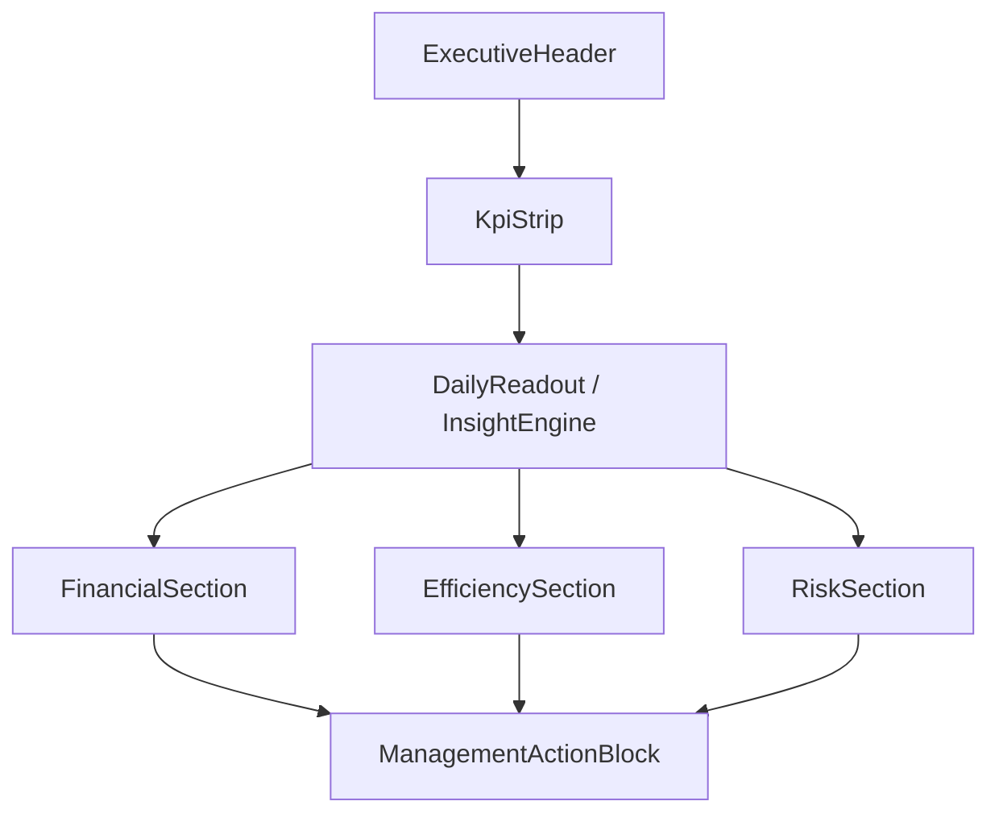

# Executive Dashboard Redesign Plan

## Objective
Transform the dashboard into an executive-grade decision interface: fewer redundant blocks, explicit decision narrative, and consistent KPI semantics across routes.

## Consolidated Diagnosis
- Redundant and non-functional UI blocks across multiple routes (for example, `Carteira` filter with no effective data impact in some pages).
- Inconsistent metric definitions (CPC vs conversion) and inconsistent ranking labels.
- Excessive chart density without explicit reading hierarchy (especially in analysis pages).
- Missing executive context layer ("what to decide now") and weak risk-vs-return synthesis.
- **No chart-type specification anywhere** — documents say *what data* to show but never *how* to visualize it, leaving agents free to invent inconsistent chart types.
- **No Daily Readout logic defined** — the plan describes a card with "2 insights + 1 action" but no source of truth for how insights are generated.

## Intervention Scope (all pages)
- [Home Page](c:\Users\Edson Vitor TI\Documents\dash relatorio\agecob-lens\src\pages\Index.tsx)
- [Productivity Analysis](c:\Users\Edson Vitor TI\Documents\dash relatorio\agecob-lens\src\pages\AnaliseProdutividade.tsx)
- [Agent Detail](c:\Users\Edson Vitor TI\Documents\dash relatorio\agecob-lens\src\pages\DetalhamentoAgentes.tsx)
- [Agent Comparison](c:\Users\Edson Vitor TI\Documents\dash relatorio\agecob-lens\src\pages\ComparacaoAgentes.tsx)
- [Current chart panels](c:\Users\Edson Vitor TI\Documents\dash relatorio\agecob-lens\src\components\charts)
- [Metric contract](c:\Users\Edson Vitor TI\Documents\dash relatorio\agecob-lens\src\services\api.ts)

## Proposed Information Architecture

### 1) Layer 1 (30-second executive answer)
- 4 to 6 fixed KPIs across all primary routes:
  - Financial output (`Σ valor_acordos`)
  - Immediate cash-in (`Σ valor_primeira_parcela`)
  - CPC (`contatos/acionamentos`)
  - Agreement conversion (`acordos/acionamentos`)
  - Average ticket (`valor_acordos/qtd_acordos`)
  - Exceptions (% over agreements or value)
- One "Daily Readout" block with 2 automatic bullets (insight + alert).

### 2) Layer 2 (visual explanation)
- Reduce chart count per page and keep at most 2–3 charts per section.
- Explicitly separate "Volume" and "Value" whenever units differ.
- Avoid repeated charts over the same ordering/base dimension.

### 3) Layer 3 (action)
- Top opportunities and risks in business language.
- BU highlights (AUTOS vs CONSUMER) for resource-allocation decisions.

---

## Visual Encoding Specification (chart type dictionary)

This section is the **single source of truth** for which chart type to use in every slot. No chart should be implemented without referencing this table. All charts use Recharts.

### Global Rules
- **Never mix units (count vs. BRL) on the same Y axis.** If a chart needs both, use dual Y axes (`yAxisId="left"` / `yAxisId="right"`) or split into two charts.
- **Never use a trend line connecting unrelated categorical bars.** Lines are only valid for time-series or continuous dimensions.
- **Labels always above bars** (`LabelList position="top"`), never inside bars that may be too small.
- **Brazilian locale everywhere:** thousands separator `.`, decimal `,`, currency prefix `R$`.
- **Color coding by semantic role, not by arbitrary assignment:**
  - Blue tones → volume / count metrics (acionamentos, contatos, acordos qty)
  - Green tones → financial / positive outcome (valor_acordos, valor_primeira_parcela)
  - Amber/orange → efficiency / rate metrics (CPC, conversion, ticket)
  - Red tones → risk / alert metrics (exceptions, low performance)
- **Responsive:** `ResponsiveContainer width="100%" height={300}`. Below `md` breakpoint, 1 chart per row (grid-cols-1).

### Chart Slots by Page

#### Home Page — Row 3 Left: BU Outcome (AUTOS vs CONSUMER)

| Attribute | Value |
|---|---|
| **Chart type** | `BarChart` — **Grouped bars (side-by-side)** |
| **Orientation** | Vertical bars |
| **X axis** | 2 categories: `AUTOS`, `CONSUMER` |
| **Y axis** | BRL (single axis, both metrics share same unit) |
| **Bars** | 2 per category: `valor_acordos` (green-600) + `valor_primeira_parcela` (green-400) |
| **Labels** | `LabelList position="top"`, formatted as `R$ X.XXX,XX` |
| **Legend** | Bottom, horizontal: "Valor Acordos" / "1ª Parcela" |
| **Why grouped bars** | Enables direct visual comparison of absolute financial output between BUs. Stacked would hide individual magnitudes. |

#### Home Page — Row 3 Right: BU Efficiency (CPC + Conversion)

| Attribute | Value |
|---|---|
| **Chart type** | `BarChart` — **Grouped bars (side-by-side)** |
| **Orientation** | Vertical bars |
| **X axis** | 2 categories: `AUTOS`, `CONSUMER` |
| **Y axis** | Percentage (0–100%) |
| **Bars** | 2 per category: `CPC %` (amber-500) + `Conversão %` (amber-300) |
| **Labels** | `LabelList position="top"`, formatted as `XX,X%` |
| **Reference line** | Horizontal `ReferenceLine` at office-wide average for each metric (dashed, labeled) |
| **Why grouped bars** | Both metrics share the same unit (%). Reference line gives instant "above/below average" reading per BU. |

#### Home Page — Row 4: Top 10 by Agreed Value

| Attribute | Value |
|---|---|
| **Chart type** | `BarChart` — **Horizontal bars** |
| **Orientation** | Horizontal (`layout="vertical"`) |
| **Y axis** | Agent names (sorted descending by `valor_acordos`) |
| **X axis** | BRL |
| **Bars** | 1 bar per agent: `valor_acordos` (green-600) |
| **Secondary column** | `qtd_acordos` shown as text label at end of bar |
| **Why horizontal** | Agent names need horizontal space; vertical bars would require rotated labels. Top-to-bottom reading matches ranking intuition. |

#### AnaliseProdutividade — Section A: Financial

**Chart A1: valor_acordos by portfolio/BU**

| Attribute | Value |
|---|---|
| **Chart type** | `BarChart` — **Horizontal bars** |
| **Orientation** | Horizontal (`layout="vertical"`) |
| **Y axis** | Portfolio names (`CART_MASTER.APELIDO`), sorted descending by value |
| **X axis** | BRL |
| **Bars** | 1 bar per portfolio, color-coded by BU: green-600 (AUTOS) / green-400 (CONSUMER) |
| **Why horizontal** | Portfolio names vary in length; horizontal layout avoids label truncation. |

**Chart A2: Top-N agent valor_primeira_parcela**

| Attribute | Value |
|---|---|
| **Chart type** | `BarChart` — **Horizontal bars** |
| **Orientation** | Horizontal (`layout="vertical"`) |
| **Y axis** | Agent names, sorted descending by `valor_primeira_parcela` |
| **X axis** | BRL |
| **Bars** | 1 bar per agent (green-400) |
| **N** | Top 10 (configurable via prop) |

#### AnaliseProdutividade — Section B: Efficiency

**Chart B1: Volume by BU (split from value)**

| Attribute | Value |
|---|---|
| **Chart type** | `BarChart` — **Grouped bars** |
| **Orientation** | Vertical |
| **X axis** | 2 categories: `AUTOS`, `CONSUMER` |
| **Y axis** | Count (qtd) |
| **Bars** | 2 per category: `qtd_acionamentos` (blue-600) + `qtd_contatos` (blue-400) |
| **Why separate from value** | Avoids the exact problem shown in the current "Distribuição de Produtividade" chart — mixing counts and BRL on the same axis. |

**Chart B2: Conversion by BU**

| Attribute | Value |
|---|---|
| **Chart type** | `BarChart` — **Grouped bars** |
| **Orientation** | Vertical |
| **X axis** | 2 categories: `AUTOS`, `CONSUMER` |
| **Y axis** | Percentage |
| **Bars** | 2 per category: `CPC %` (amber-500) + `Conversão Acordos %` (amber-300) |
| **Reference line** | Office-wide average (dashed) |

#### AnaliseProdutividade — Section C: Risk/Quality

**Chart C1: Exceptions by portfolio**

| Attribute | Value |
|---|---|
| **Chart type** | `BarChart` — **Horizontal bars** |
| **Orientation** | Horizontal |
| **Y axis** | Portfolio names, sorted descending by exception count or value |
| **X axis** | Count or BRL (choose one; do not mix) |
| **Bars** | 1 per portfolio (red-500) |
| **Data source** | Real exception data (`ID_REC_STATUS = 11`), never synthetic proxy |

**Chart C2: Exceptions by agent**

| Attribute | Value |
|---|---|
| **Chart type** | `BarChart` — **Horizontal bars** |
| **Orientation** | Horizontal |
| **Y axis** | Agent names, sorted descending |
| **X axis** | `qtd_excecoes / qtd_acordos * 100` (exception rate %) |
| **Bars** | 1 per agent (red-400) |
| **Reference line** | Office-wide exception rate average (dashed red-300) |

#### DetalhamentoAgentes — Row 2 Left: Volume

| Attribute | Value |
|---|---|
| **Chart type** | `BarChart` — **Vertical bars, 2 bars** |
| **X axis** | 2 categories: `Acionamentos`, `Contatos` |
| **Y axis** | Count |
| **Bars** | blue-600, blue-400 |
| **Subtitle** | `CPC: XX,X%` derived below chart |

#### DetalhamentoAgentes — Row 2 Right: Value

| Attribute | Value |
|---|---|
| **Chart type** | `BarChart` — **Vertical bars, 2 bars** |
| **X axis** | 2 categories: `1ª Parcela`, `Valor Acordos` |
| **Y axis** | BRL |
| **Bars** | green-400, green-600 |
| **Subtitle** | `Ticket médio: R$ X.XXX,XX` derived below chart |

#### ComparacaoAgentes — Row 2: Effort vs Result Scatter

| Attribute | Value |
|---|---|
| **Chart type** | `ScatterChart` |
| **X axis** | `qtd_acionamentos` (effort) |
| **Y axis** | `valor_acordos` (result, BRL) |
| **Dots** | 1 per agent, color-coded by BU if both selected |
| **Tooltip** | Agent name + both values |
| **Quadrant lines** | Median X and median Y as `ReferenceLine` (dashed), creating 4 quadrants: high-effort/high-result (top-right), low-effort/high-result (top-left = stars), etc. |
| **Why scatter** | Reveals effort-to-result efficiency at a glance. Quadrant logic makes coaching decisions visual. |
| **API dependency note** | Requires both `qtd_acionamentos` and `valor_acordos` in the same response from `/dashboard/comparacao-agentes/{db}`. **Validate** that the current endpoint returns both fields. If not, this requires a backend contract change (documented in Risks). |

---

## Daily Readout — Insight Engine Specification

The Daily Readout card displays 2 automatic insights + 1 management action. This section defines **where the logic lives and how phrases are generated.**

### Architecture Decision
The insight engine is a **frontend-only deterministic module** (`src/lib/insightEngine.ts`). It consumes the same data already available from existing API responses — no new endpoint required. This keeps it within the "no backend contract change" constraint of Wave C.

### Rule-to-Phrase Mapping

Each rule evaluates a condition against the current data and produces a phrase with severity (`positive` | `warning` | `critical`).

| Rule ID | Condition | Severity | Output template |
|---|---|---|---|
| `insight_cpc_above_avg` | CPC today > 30-day rolling avg (if available) OR CPC > 40% | `positive` | "CPC está em {value}%, acima da média do escritório." |
| `insight_cpc_below_avg` | CPC today < 20% | `warning` | "CPC em {value}% — abaixo do patamar operacional." |
| `insight_conversion_drop` | Conversion < 5% with > 100 acionamentos | `critical` | "Conversão em {value}% com alto volume de acionamentos. Verificar qualidade dos contatos." |
| `insight_exception_spike` | Exception count > 2× average (if available) OR > 10 in day | `warning` | "Volume de exceções elevado: {value} hoje." |
| `insight_first_installment_high` | `valor_primeira_parcela / valor_acordos > 60%` | `positive` | "Primeira parcela representa {value}% do valor acordado — bom sinal de entrada de caixa." |
| `insight_concentration` | Top 3 agents > 70% of total `valor_acordos` | `warning` | "Concentração alta: Top 3 agentes respondem por {value}% do valor total." |
| `action_bu_focus` | One BU has > 2× the conversion of the other | `action` | "Considere realocar capacidade para {bu_name} — conversão {value}% maior." |
| `action_exception_review` | Exception rate > 15% of total agreements | `action` | "Revisar política de exceções — taxa em {value}%." |
| `action_no_signal` | No condition triggered | `action` | "Operação dentro dos parâmetros. Sem ação imediata recomendada." |

### Selection Logic
1. Evaluate all rules against current data.
2. Pick the highest-severity `positive` or `warning` insight → slot 1.
3. Pick the second-highest from a different category → slot 2.
4. Pick the highest-priority `action` → slot 3.
5. If no rules fire, show neutral state: "Dados insuficientes para gerar insights automáticos."

### Component Contract
```typescript
interface InsightEngineOutput {
  insight1: { text: string; severity: 'positive' | 'warning' | 'critical' };
  insight2: { text: string; severity: 'positive' | 'warning' | 'critical' };
  action: { text: string; severity: 'action' };
}

// Usage in ExecutiveInsightCard
function generateDailyReadout(data: ProdutividadeData): InsightEngineOutput
```

---

## Target Architecture by Page (exact information distribution)

### Shared structural pattern (all pages)
- **Executive header (fixed):** page title + period + active filters summarized as chips.
- **KPI strip (row 1):** keep **all existing KPIs** per page, with visual hierarchy:
  - **Primary KPIs (highlighted):** Output, Cash-in, CPC, Conversion.
  - **Secondary KPIs (same row or row 2):** Ticket, Exceptions, and all other existing route indicators.
  - No current KPI is removed; only reordered and semantically standardized.
- **Daily Readout (row 2):** 1 wide card with output from InsightEngine (see section above).
- **Analytical body (row 3+):** maximum of 2 blocks per row, without repeating the same dimension in different visuals. Chart type for each slot defined in Visual Encoding Specification above.

### Home Page ([Index](c:\Users\Edson Vitor TI\Documents\dash relatorio\agecob-lens\src\pages\Index.tsx))
- **Objective:** answer "how are we doing today?" in 20–30 seconds.
- **Final layout:**
  - Row 1: all existing home KPIs, with visual emphasis on the 4 decision KPIs.
  - Row 1B (if needed): continuation of complementary KPIs.
  - Row 2: "Daily Readout" card (InsightEngine output).
  - Row 3: 2 charts (see Visual Encoding Specification):
    - **Left:** BU Outcome → Grouped BarChart (valor_acordos + valor_primeira_parcela by BU).
    - **Right:** BU Efficiency → Grouped BarChart (CPC% + Conversão% by BU with reference lines).
  - Row 4: Top 10 by agreed value → Horizontal BarChart with secondary qtd_acordos column.
- **Definitive removal:** duplicated rankings over identical ordering.

### Productivity Analysis ([AnaliseProdutividade](c:\Users\Edson Vitor TI\Documents\dash relatorio\agecob-lens\src\pages\AnaliseProdutividade.tsx))
- **Objective:** explain *why* the outcome happened.
- **Final layout by section:**
  - **Section A — Financial:** 2 horizontal bar charts (see Visual Encoding A1, A2).
  - **Section B — Efficiency:** 2 grouped vertical bar charts (see Visual Encoding B1, B2).
  - **Section C — Risk/Quality:** 2 horizontal bar charts for exceptions (see Visual Encoding C1, C2).
- **Organization rule:** keep only one chart panel (merge ideas from `AnaliseChartsPanel` and `DashboardV2ChartsPanel`).
- **Remove:** any synthetic exception proxy and any chart that repeats the same story.

### Agent Detail ([DetalhamentoAgentes](c:\Users\Edson Vitor TI\Documents\dash relatorio\agecob-lens\src\pages\DetalhamentoAgentes.tsx))
- **Objective:** provide individual performance drill-down without overloading with operational micro-data.
- **Final layout:**
  - Row 1: compact selected-agent summary (5 KPIs: agreements, value, CPC, conversion, ticket).
  - Row 2: 2 vertical bar charts (see Visual Encoding: Volume left, Value right).
  - Row 3: "Today's agreements" as a collapsible table (collapsed by default, expanded on demand).
- **Agent sidebar:** add search + top-N shortcuts; avoid long unstructured lists.
- **Redundancy rule:** do not duplicate contact/no-contact decomposition in both chart and table simultaneously.

### Agent Comparison ([ComparacaoAgentes](c:\Users\Edson Vitor TI\Documents\dash relatorio\agecob-lens\src\pages\ComparacaoAgentes.tsx))
- **Objective:** compare agents/groups for allocation and coaching decisions.
- **Final layout:**
  - Row 1: 4 comparative KPIs (best, worst, median, dispersion).
  - Row 2: ScatterChart — effort vs result with quadrant lines (see Visual Encoding).
  - Row 3: comparative table sorted by selected metric with relative variation.
  - Row 4: "Who to prioritize today" block (Top 3 opportunities + Top 3 risks).
- **Rule:** enforce one consistent CPC/conversion terminology, no competing formulas on the same page.

---

## Component Blueprint (implementation)

### New reusable components

Each component below includes a minimal prop interface contract. Full TypeScript interface should live in `src/types/executive.ts`.

#### `ExecutiveKpiStrip`
```typescript
interface ExecutiveKpiStripProps {
  kpis: Array<{
    label: string;           // e.g. "Valor Acordos"
    value: number;
    unit: 'BRL' | '%' | 'count';
    formula?: string;        // shown in tooltip, e.g. "Σ valor_acordos"
    priority: 'primary' | 'secondary';
    trend?: 'up' | 'down' | 'stable'; // optional delta indicator
  }>;
  loading?: boolean;         // shows Skeleton placeholders
  error?: string;            // shows inline error state
}
```
- **Responsive:** primary KPIs in first row (always visible); secondary KPIs in second row (collapsible on mobile).
- **Empty state:** "Dados não disponíveis" with muted text.

#### `ExecutiveInsightCard`
```typescript
interface ExecutiveInsightCardProps {
  insight1: { text: string; severity: 'positive' | 'warning' | 'critical' };
  insight2: { text: string; severity: 'positive' | 'warning' | 'critical' };
  action: { text: string; severity: 'action' };
  loading?: boolean;
  empty?: boolean;           // "Sem sinais operacionais detectados."
}
```
- **Severity mapping:** positive → green icon, warning → amber icon, critical → red icon, action → blue icon.
- **Layout:** 3 rows inside a single Card. No nested cards.

#### `SectionHeader`
```typescript
interface SectionHeaderProps {
  title: string;             // e.g. "Financeiro"
  description?: string;      // e.g. "Resultados em valor de acordos e primeira parcela"
  unit?: string;             // e.g. "BRL" — shown as badge
}
```

#### `ExecutiveRankingTable`
```typescript
interface ExecutiveRankingTableProps {
  title: string;
  rows: Array<{
    rank: number;
    label: string;           // agent or portfolio name
    primaryValue: number;
    primaryUnit: 'BRL' | '%' | 'count';
    secondaryValue?: number;
    secondaryUnit?: 'BRL' | '%' | 'count';
  }>;
  primaryColumnLabel: string;   // e.g. "Valor Acordos"
  secondaryColumnLabel?: string; // e.g. "Qtd Acordos"
  maxRows?: number;             // default 10
  loading?: boolean;
  empty?: boolean;
}
```

### Existing components to refactor
- [AnaliseChartsPanel](c:\Users\Edson Vitor TI\Documents\dash relatorio\agecob-lens\src\components\charts\AnaliseChartsPanel.tsx)
- [DashboardV2ChartsPanel](c:\Users\Edson Vitor TI\Documents\dash relatorio\agecob-lens\src\components\charts\DashboardV2ChartsPanel.tsx)
- [DetalhamentoChartsPanel](c:\Users\Edson Vitor TI\Documents\dash relatorio\agecob-lens\src\components\charts\DetalhamentoChartsPanel.tsx)
- [AgentComparisonDashboard](c:\Users\Edson Vitor TI\Documents\dash relatorio\agecob-lens\src\components\AgentComparisonDashboard.tsx)

---

## Metric Architecture (single dictionary)

### Official Definitions
- **CPC:** `Σ qtd_contatos / Σ qtd_acionamentos`
- **Agreement conversion:** `Σ qtd_acordos / Σ qtd_acionamentos`
- **Average ticket:** `Σ valor_acordos / Σ qtd_acordos`
- **Exceptions (% value):** `Σ valor_excecoes / Σ valor_acordos`

### Additional Derived KPIs (Wave C)
- **Exception rate (count):** `Σ qtd_excecoes / Σ qtd_acordos * 100` — complementary to % value
- **Result concentration:** `Σ valor_acordos (Top 3) / Σ valor_acordos (total) * 100`
- **Average productivity per agent:** `Σ valor_acordos / count(distinct agents)`
- **Operational Health Score:** Weighted average of normalized primary KPIs (CPC, conversion, ticket, exception rate). Weights defined by business. Scale 0–100. This is the headline number of the Daily Readout.
- **Marginal efficiency:** At what acionamento volume does conversion rate start declining per agent? Derived from binned analysis of `qtd_acionamentos` vs `taxa_conversao` per agent. Useful for coaching recommendations.

### KPI Preservation Policy
- All KPIs currently present in the dashboard are preserved.
- Redesign scope is limited to:
  - reading order;
  - priority grouping;
  - label/unit clarity;
  - visual redundancy removal (not indicator removal).

### Presentation Rules
- Every metric must expose:
  - short label (card),
  - standardized formula (tooltip),
  - explicit unit (BRL, %, count).
- Forbid ambiguous labels such as "Conversion Rate" without formula context.

---

## Cross-Document Reference: Operational Analysis Pipeline

This redesign plan covers the **same-day operational dashboard**. A parallel document — [pipeline-analise-operacional.md](pipeline-analise-operacional.md) — defines the **historical/medium-term Operational Analysis area** (multi-week/month window with descriptive, diagnostic, and prescriptive layers).

### Relationship
- Same-day dashboard (this plan) → "How are we doing today?"
- Operational Analysis (pipeline doc) → "What patterns exist over weeks/months and what should we change?"

### Navigation Architecture
The user flow across pages should follow this mental model:

```
Index (today's synthesis)
  ├── "I need detail" → DetalhamentoAgentes (agent drill-down)
  ├── "I need to compare" → ComparacaoAgentes (multi-agent comparison)
  ├── "I need to understand why" → AnaliseProdutividade (today's explanation)
  └── "I need historical patterns" → AnaliseOperacional (multi-week/month analysis)
       ├── Descriptive → "what happened over time"
       ├── Diagnostic → "why it happened"
       └── Prescriptive → "what to do about it"
```

Both documents should be versioned together and cross-referenced on any change that affects shared metrics or components.

### BU Comparison Gap
The Operational Analysis pipeline currently has no `corte=bu` diagnostic slice for comparing AUTOS vs CONSUMER over time. This should be added as a diagnostic cut (see additions in pipeline document).

---

## Target Executive Reading Flow



---

## Wave-based Execution Plan

### Wave A — Consistency and Clarity (high immediate impact)
- Standardize metric dictionary and terminology (CPC, conversion, ticket, exceptions).
- Fix inconsistent labels (rankings/titles not aligned with actual ordering).
- Remove or hide non-functional controls (or connect them to actual filtering).
- Apply Visual Encoding Specification to all existing charts (fix the "Distribuição de Produtividade" mixed-unit problem first).

### Wave B — Page-level Content Reorganization
- **Index:** keep executive synthesis + one non-duplicated ranking block + BU comparison charts (grouped bars).
- **Analysis:** consolidate duplicated panels into "Financial", "Efficiency", and "Risk" sections with specified chart types.
- **Detail:** move agent summary to the top and demote detailed table to secondary level. Volume/Value split charts.
- **Comparison:** add ScatterChart (effort vs result), align effective filters and unify conversion/CPC semantics.

### Wave C — Additional Executive Value (no backend contract change)
- Implement InsightEngine (`src/lib/insightEngine.ts`) with deterministic rule-to-phrase mapping.
- Add ExecutiveInsightCard (Daily Readout) to Index and AnaliseProdutividade.
- Add derived KPIs already available in frontend data:
  - Exceptions/agreed-value ratio
  - Result concentration (Top 3 over total)
  - Average productivity per agent
  - Operational Health Score (composite)
- Add cohort awareness: flag agents with < 30 days tenure in rankings (visual badge, not filter in v1).

---

## Success Criteria (acceptance)
- Every page clearly answers: "result", "efficiency", and "risk" with no formula ambiguity.
- No redundant card/chart in the same viewport context.
- No visible filter without real data impact.
- Every chart matches its Visual Encoding Specification entry (type, orientation, color, labels).
- Daily Readout generates at least 1 insight from real data on any non-empty day.
- Executive reading path completed in <= 1 minute per page.

## Risks and Dependencies
- Trend/target views require historical series (outside initial wave scope).
- Business validation required for aggregations involving average metrics (`acordo_medio`, `desconto_medio_percentual`, `parcelamento_medio`).
- Exception handling must be reviewed to ensure real data usage (no synthetic proxies).
- **ScatterChart in ComparacaoAgentes** requires `qtd_acionamentos` and `valor_acordos` in the same API response. Validate `/dashboard/comparacao-agentes/{db}` returns both. If not, this is a backend contract change.
- **Operational Health Score** weights need business sign-off before implementation.
- **InsightEngine** thresholds (CPC 20%/40%, exception 2×, concentration 70%) are initial estimates — need business calibration after first deployment.
